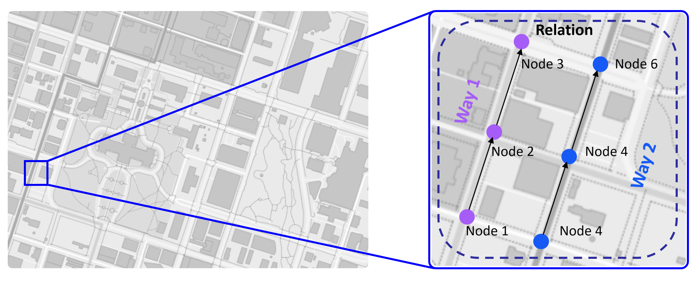
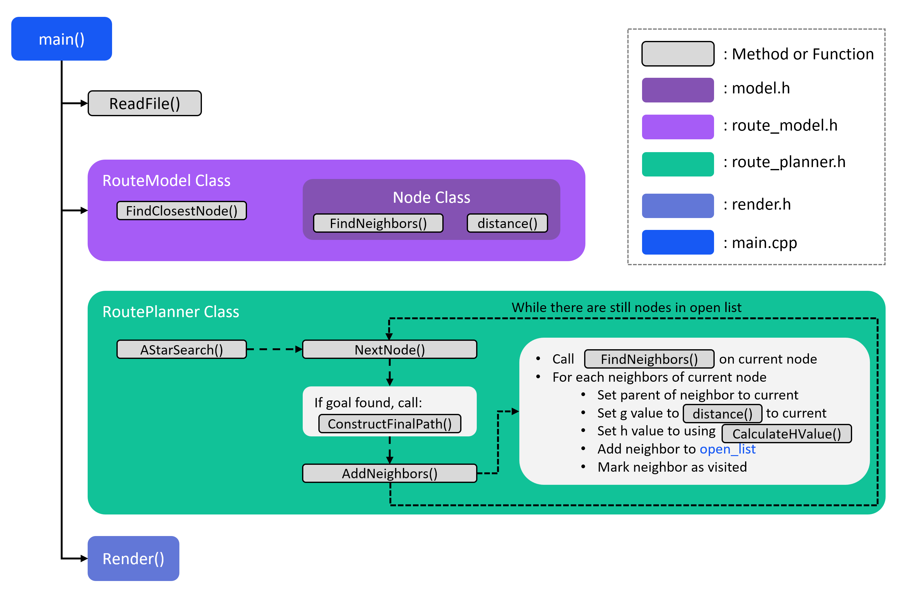

# A* Route Planning

This project involves building a **route planner** that calculates a path between two points on a real map using [OpenStreetMap](https://www.openstreetmap.org/) data. The application leverages the **A*** algorithm and a 2D rendering library called **IO2D** to visualize the map and the calculated route. The project is structured with object-oriented programming principles and includes multiple files, pointers, references, and other advanced coding techniques.


## OpenStreetMap Data

The [OpenStreetMap](https://www.openstreetmap.org/) project is an open-source, collaborative endeavor to create free, user-generated maps of every part of the world. These maps are similar to Google Maps or the Apple Maps app, but they are completely generated by individuals who volunteer to perform ground surveys of their local environment.

OpenStreetMap data can come in several different formats. The data that is used for this project comes in the form of an OSM XML file (`.osm` file),  [sample](./map.osm) as below which came from the [OpenStreetMap Wiki](https://wiki.openstreetmap.org/wiki/Main_Page). 

```xml
<?xml version="1.0" encoding="UTF-8"?>
<osm version="0.6" generator="CGImap 0.0.2">
 <bounds minlat="54.0889580" minlon="12.2487570" maxlat="54.0913900" maxlon="12.2524800"/>
 <node id="298884269" lat="54.0901746" lon="12.2482632" user="SvenHRO" uid="46882" visible="true" version="1" changeset="676636" timestamp="2008-09-21T21:37:45Z"/>
 <node id="261728686" lat="54.0906309" lon="12.2441924" user="PikoWinter" uid="36744" visible="true" version="1" changeset="323878" timestamp="2008-05-03T13:39:23Z"/>
 <node id="1831881213" version="1" changeset="12370172" lat="54.0900666" lon="12.2539381" user="lafkor" uid="75625" visible="true" timestamp="2012-07-20T09:43:19Z">
  <tag k="name" v="Neu Broderstorf"/>
  <tag k="traffic_sign" v="city_limit"/>
 </node>
 ...
 <node id="298884272" lat="54.0901447" lon="12.2516513" user="SvenHRO" uid="46882" visible="true" version="1" changeset="676636" timestamp="2008-09-21T21:37:45Z"/>
 <way id="26659127" user="Masch" uid="55988" visible="true" version="5" changeset="4142606" timestamp="2010-03-16T11:47:08Z">
  <nd ref="292403538"/>
  <nd ref="298884289"/>
  ...
  <nd ref="261728686"/>
  <tag k="highway" v="unclassified"/>
  <tag k="name" v="Pastower Straße"/>
 </way>
 <relation id="56688" user="kmvar" uid="56190" visible="true" version="28" changeset="6947637" timestamp="2011-01-12T14:23:49Z">
  <member type="node" ref="294942404" role=""/>
  ...
  <member type="node" ref="364933006" role=""/>
  <member type="way" ref="4579143" role=""/>
  ...
  <member type="node" ref="249673494" role=""/>
  <tag k="name" v="Küstenbus Linie 123"/>
  <tag k="network" v="VVW"/>
  <tag k="operator" v="Regionalverkehr Küste"/>
  <tag k="ref" v="123"/>
  <tag k="route" v="bus"/>
  <tag k="type" v="route"/>
 </relation>
 ...
</osm>
```

We have three element types in the XML map data above: 

- **Node**

  A [*node*](https://wiki.openstreetmap.org/wiki/Node) is one of the most basic elements in the OpenStreetMap data model. Each node indicates a **single point** with an identifier `id`, latitude `lat`, and longitude `lon`. There are other XML attributes in a node element that won't be relevant to this project, such as the `user` id and the `timestamp` when the node was added to the data set. Additionally, a node can have several tags which provide additional information.

- **Way**

  A [*way*](https://wiki.openstreetmap.org/wiki/Way) is an **ordered list of nodes** that represents a feature in the map. This feature could be a **road**, or a boundary of a park, or some other feature in the map. Each way has at least one `tag` which denotes some information about the way, and **each way also belongs to at least one relation**, which is described below.

- **Relation**

  A [*relation*](https://wiki.openstreetmap.org/wiki/Relation) is a data structure which documents a relationship between other data elements. Examples from the [OpenStreetMap wiki](https://wiki.openstreetmap.org/wiki/Relation) include:

  > - A route relation which lists the ways that form a major highway, cycle route, or bus route.

  A multi-polygon that describes an area with holes, where the outer and inner boundaries of the area are given by two ways.

<div align="center">
  
</div>

Basically, we can view these three concept like above illustrated figure:

- Node: A single point on the bus route

- Way: A collection of points that form a road on the bus route
- Relation: A collection of roads the form the entire route

For this project, we will primarily be working with Nodes, both the code to parse the OSM data and the data structures which are used to store the data in this program have already been written in the [IO2D OpenStreetMap example](https://github.com/cpp-io2d/P0267_RefImpl/tree/master/P0267_RefImpl/Samples/maps). In this project, we extends the code in order to plot a path between two points.


## Build

This project use CMake as its build system and has been tested on [WSL Ubuntu 24.04](https://documentation.ubuntu.com/wsl/en/latest/guides/install-ubuntu-wsl2/). Therefore, the following procedures primarily focus on Windows 11 Subsystem for Linux (WSL) with Ubuntu. However, they may also work for users of Ubuntu Desktop or Ubuntu Server. If you don't have a WSL Ubuntu System, using below command to create one.

- Create a new [WSL Ubuntu](https://learn.microsoft.com/en-us/windows/wsl/install) Instance (open as administrator)

  ```cmd
  # in Windows PowerShell
  wsl --install Ubuntu-24.04
  ```


### **Prerequisites**

We need to install the project dependencies and including the IO2D library before building project. Since installing IO2D library can be difficult, please stick with the procedures as below.


#### Dependencies

After WSL Ubuntu installed, install below basic packages in it

```bash
sudo apt update
sudo apt install -y build-essential
sudo apt install -y cmake
sudo apt install -y git
sudo apt install -y gcc g++
sudo apt install -y pkg-config
```
> make sure versions:
>
> -  `cmake` version `> 3.14`
> - `g++` version `> 7`


#### Packages

```bash
sudo apt install -y libcairo2-dev
sudo apt install -y libgraphicsmagick1-dev
sudo apt install -y libpng-dev
```


#### Compile io2d

Then compile and install io2d:
```
cd ~
git clone --recurse-submodules https://github.com/cpp-io2d/P0267_RefImpl

# Update original svgpp to latest
cd P0267_RefImpl/P0267_RefImpl/Samples/svg/external
rm -rf svgpp
git clone --recurse-submodules https://github.com/svgpp/svgpp.git

# Update catch.hpp file
cd ~/P0267_RefImpl/P0267_RefImpl/Tests/Catch2/single_include/
rm catch.hpp
wget https://raw.githubusercontent.com/potassco/libpotassco/2003fc8a4fd0e9b1435108b05a8ac36706b14bd3/tests/catch.hpp

# Compile io2d
cd ~/P0267_RefImpl
mkdir Debug && cd Debug
cmake -DCMAKE_BUILD_TYPE=Debug ..
cmake --build .
make
sudo make install
```


### Compile

At that point the project code should be compliable and run:

> Note: When cloning this project, be sure to use the `--recurse-submodules` flag. Using HTTPS:

```
# Compile project
cd ~/projects/
git clone https://github.com/deepbiolab/star-route-planning.cpp.git --recurse-submodules
cd star-route-planning.cpp
mkdir build && cd build
cmake -DTESTING="AStarSearch" ..
make
```


## Run

The executable will be placed in the `build` directory. From within `build`, you can run the project as follows:

```
cd star-route-planning.cpp/build
./OSM_A_star_search
```

Or to specify a map file:
```
./OSM_A_star_search -f ../<your_osm_file.osm>
```

After run this program, and type initial point and goal point on a map, you can see the route plot on the map, like below:

<div align="center">
  
</div>

## Test

The testing executable is also placed in the `build` directory. From within `build`, you can run the unit tests as follows:

```bash
# Run unit tests
cd star-route-planning.cpp/build/
./test
```

After run unit tests, printed results should like this:

```bash
[==========] Running 7 tests from 2 test cases.
[----------] Global test environment set-up.
[----------] 6 tests from RouteModelTest
[ RUN      ] RouteModelTest.RouteModelData
[       OK ] RouteModelTest.RouteModelData (63 ms)
[ RUN      ] RouteModelTest.RouteModelNode
[       OK ] RouteModelTest.RouteModelNode (55 ms)
[ RUN      ] RouteModelTest.NodeDistance
[       OK ] RouteModelTest.NodeDistance (52 ms)
[ RUN      ] RouteModelTest.NodeToRoad
[       OK ] RouteModelTest.NodeToRoad (52 ms)
[ RUN      ] RouteModelTest.FindNeighbors
[       OK ] RouteModelTest.FindNeighbors (51 ms)
[ RUN      ] RouteModelTest.FindClosestNode
[       OK ] RouteModelTest.FindClosestNode (53 ms)
[----------] 6 tests from RouteModelTest (326 ms total)

[----------] 1 test from RoutePlannerTest
[ RUN      ] RoutePlannerTest.AStarSearch
[       OK ] RoutePlannerTest.AStarSearch (59 ms)
[----------] 1 test from RoutePlannerTest (59 ms total)

[----------] Global test environment tear-down
[==========] 7 tests from 2 test cases ran. (386 ms total)
[  PASSED  ] 7 tests.
```

-----

## Model Architecture

<div align="center">
  
</div>

### `RouteModel` class
- **Purpose**: The `RouteModel` class serves as a data structure to hold all OpenStreetMap data in a convenient format and provides methods for interacting with the data.
- **Key Features**:
  - Contains a subclass `Node`, which represents a single point in the map.
  - **Important Methods**:
    - `FindNeighbors`: Finds all valid neighboring nodes for the current node.
    - `Distance`: Calculates the distance between two nodes.

### `RoutePlanner` class
- **Purpose**: The `RoutePlanner` class implements the A* search algorithm and contains all methods required for pathfinding.

- **Key Features**:
  - **`AStarSearch` Method**:
  
    - Executes the A* search algorithm in a `while` loop until the open node list is empty.
  
    - For each iteration:
      1. Selects the next node using`NextNode`: Sorts the open list and selects the next node to explore.
  
      2. Checks if the current node is the goal:
  
         - if yes, using`ConstructFinalPath` to build the final path from the start node to the goal node.
  
         - if no, using `AddNeighbors` to expand the current node by adding its neighbors to the open list.
  
  - **`AddNeighbors` Method**:
  
    - Calls `FindNeighbors` to populate the neighbors of the current node.
    - For each neighbor:
      1. Sets its parent to the current node.
      2. Calculates:
         - `g` value: The cost from the start node to the current node `+` the distance to the neighbor.
         - `h` value: The heuristic value, which estimates the distance from the neighbor to the goal.
      3. Adds the neighbor to the open list and marks it as visited.

### `Render` class
- Once the goal node is found, the `ConstructFinalPath` method reconstructs the path from the start node to the goal node by tracing back through each node's parent.
- The main function then creates a render object to display the map and the final path using the results from the A* search.


## File Structure

In the repo, we have following six directories:

- **`cmake`**: This directory contains some `.cmake` files that are needed for the project to find the necessary libraries.
- **`src`**: The source code for the project is contained here.
- **`test`**: This directory contains unit tests, implemented using the Google Test framework.
- **`thirdparty`**: This directory contains third-party libraries that have been included with this project.
- **`dev`**: This directory contains notes about basic knowledge used in this project.
- **`assets`**: This directory contains image used in this readme file.

Especially, in `src` folder, we have these files:

- `main.cpp`: 
  - Controls the flow of the program, accomplishing four primary tasks:
    - A `ReadFile` function is created to read OSM data into the program.
    - A `RouteModel` object is created to store the OSM data in usable data structures.
    - A `RoutePlanner` object is created using the `RouteModel`. This planner will eventually carry out the A* search on the model data and store the search results in the `RouteModel`.
    - The `RouteModel` data is rendered using the IO2D library.
- `model.h` and `model.cpp`
  - Come from the IO2D example code which are used to define the data structures and methods that read in and store OSM data. OSM data is stored in a `Model` class which contains nested structs for Nodes, Ways, Roads, and other OSM objects.
- `route_model.h` and `route_model.cpp`: 
  - Contain classes that extend the `Model` class and the `Node` struct from `model.h` and `model.cpp` using class inheritance. This extension adds additional methods and variables that are useful for implementing A* search.
  - Specifically, the new `RouteModel::Node` class enables nodes to store the **attributes** following:
    - `h_value`: the h-value
    - `g_value`: the g-value
    - `visited`: a "visited" flag
    - `neighbors`: a vector of pointers to neighboring nodes
  - In addition, there are **methods** for
    - `FindNeighbors`: finding neighboring Node objects of a Node
    - `distance`: getting the distance to other nodes
    - `FindClosestNode`: finding the closest node to a given (x, y) coordinate pair
- `route_planner.h` and `route_planner.cpp`: 
  - Define the `RoutePlanner` class and methods for the `A *search`.
- `render.h`and `render.cpp`
  - Come from the IO2D example code. These take map data that is stored in a `Model` object and render that data as a map. In here, these files slightly modified to include three extra methods which **render the start point, end point, and path** from the A* search.


