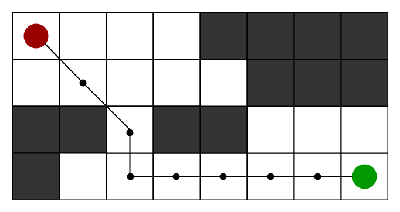

# How to Store Data

## Primitive Variable Types

C++ has several "primitive" variable types, which are things like `int`s (integers), `string`s, `float`s, and others. These should be similar to variable types in other programming languages we have used. 

**Note:** In the cells below, variables will be declared and values assigned. In C++, once a variable has been declared, it can not be redeclared in the same scope. This means that try to declare a variable twice in the same function, we will see an error.

```cpp
#include <iostream>
#include <string>
using std::cout;

int main() {
    // Declaring and initializing an int variable.
    int a = 9;
    
    // Declaring a string variable without initializing right away.
    std::string b;
    
    // Initializing the string b.
    b = "Here is a string";
    
    cout << a << "\n";
    cout << b << "\n";
}
```

```bash
$ g++ -std=c++17 ./code/type_example.cpp && ./a.out
9
Here is a string
```


## Vectors

> **Purpose**: how to declare and store a vector containing primitive types, and 2D vectors, which will be using in A* search.

### 1D Vectors

C++ also has several container types that can be used for storing data. We will start with `vector`s, as these will be used throughout this project, but we will also introduce other container types as needed.

Vectors are a sequence of elements of a single type, and have useful methods for:

- getting the size
- testing if the vector is empty, 
- and adding elements to the vector.

```cpp
#include <iostream>
#include <vector>
using std::vector;
using std::cout;

int main() {
    // Three ways of declaring and initializing vectors.
    
    // Declares and initializes a vector using brace-enclosed initializer list directly.
    vector<int> v_1{0, 1, 2};
    // Declares and initializes using an assignment-style initializer list.
    vector<int> v_2 = {3, 4, 5};
    // Declares a vector first, then assigns values
    vector<int> v_3;
    v_3 = {6};
    cout << "Everything worked!" << "\n";
}
```


### 2D Vectors
Unfortunately, there isn't a built-in way to print vectors in C++ using `cout`. We will write function to print vectors later. For now, we can see how vectors are created and stored. Below, we can see how to nest vectors to create 2D containers.

```cpp
#include <iostream>
#include <vector>
using std::vector;
using std::cout;

int main() {
    // Creating a 2D vector.
    vector<vector<int>> v {{1,2}, {3,4}};
    cout << "Great! A 2D vector has been created." << "\n";
}

/*
this 2D Vectors should like this:
1 2
3 4
*/
```


## Comments

- About Comment in C++

- Two ways to comment:

  - Single line comment:

    ```cpp
    // we can use two forward slashes for single line comments.
    ```

  - Multiple line comment:

    ```cpp
    /*
    For longer comments, we can enclose the text with an opening
    slash-star and closing star-slash.
    */ 
    ```


## Use Auto

We have now seen how to store basic types and vectors containing those types. As we declared variables, in each case we indicated the type of the variable. It is possible for C++ to do automatic type inference, using the `auto` keyword.

```cpp
#include <iostream>
#include <vector>
using std::vector;
using std::cout;

int main() {
    auto i = 5;
    auto v_6 = {1, 2, 3};
    cout << "Variables declared and initialized without explicitly stating type!" << "\n";
}
```

```bash
$ g++ -std=c++17 ./code/auto_example.cpp && ./a.out
Variables declared and initialized without explicitly stating type!
```

It is helpful to manually declare the type of a variable if we want the variable type to be **clear** for reader of our code, or if we want to be explicit about the number **precision** being used; C++ has several number types with different levels of precision, and this precision might not be clear from the value being assigned.

## Example: Store a Grid




In order to write the A* search algorithm, we will need a grid or "board" to search through. We'll be working with this board throughout the remaining exercises, and **we'll start by storing a hard-coded board** in the main function. In **later**, we will write code to **read the board from a file**. 

Implementation details see [`main.cpp`](./main.cpp)


