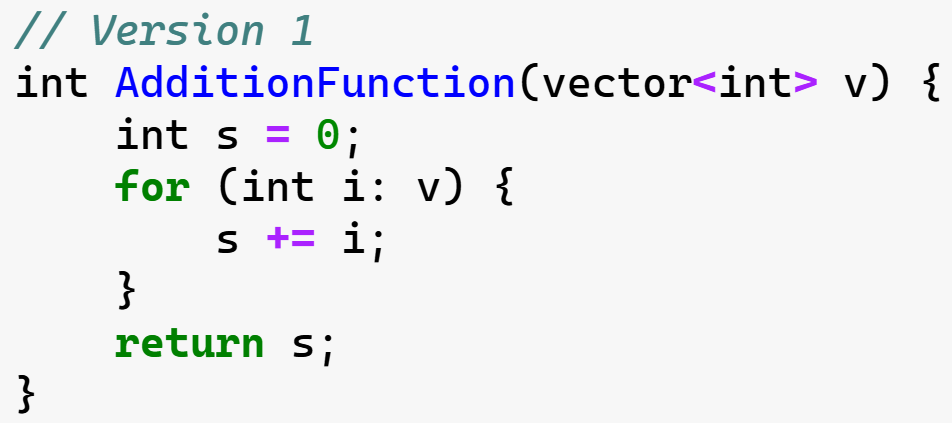
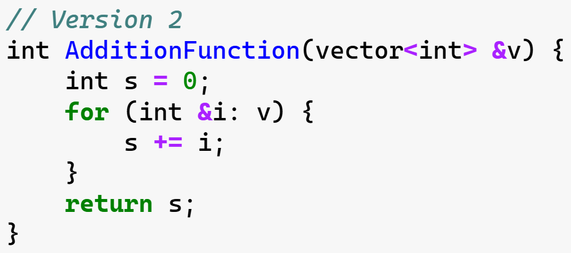
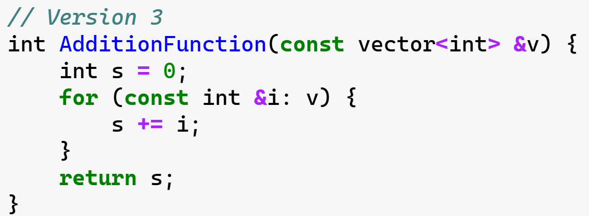
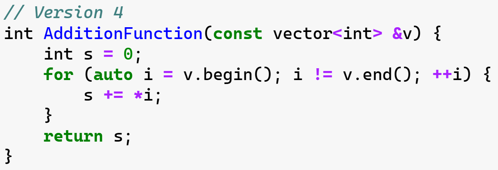
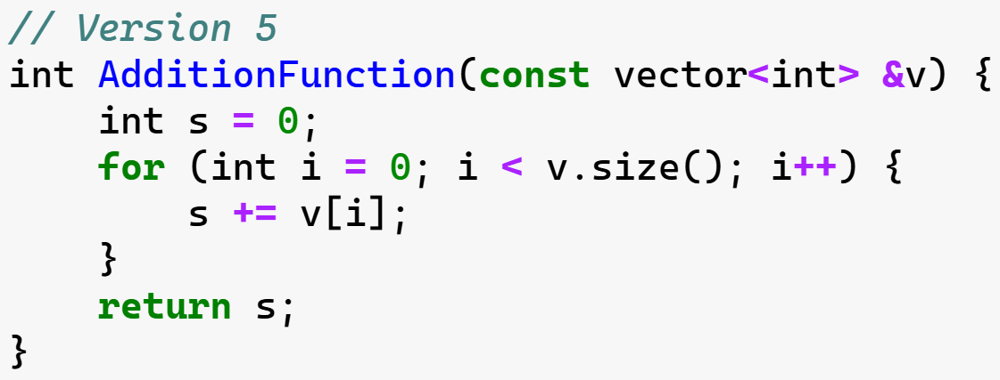
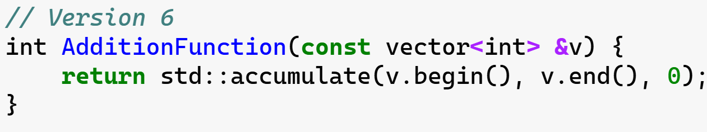

# How to Printing

In the next part, we will write a function to print out the board that we have stored. Before that, we will need to learn more about several important parts of the C++ language. Such as, how to **access elements** in the vectors we stored previously. Additionally, we will learn to **write loops** in C++. Finally, we will learn how to write C++ **functions**.

## Vector Access 

### 1D Vector

To begin, it is helpful to know how to **access vector elements** of an existing vector. 

```cpp
#include <iostream>
#include <vector>
using std::vector;
using std::cout;

int main() {
    vector<int> a = {0, 1, 2, 3, 4};
    cout << a[0];
    cout << a[1];
    cout << a[2];
    cout << "\n";
}
```

```bash
$ g++ -std=c++17 ./code/printing_ex_1.cpp && ./a.out
012
```

If you tried to access the elements of `a` using an out-of-bound index, you might have noticed that there is no error or exception thrown.
```cpp
#include <iostream>
#include <vector>
using std::vector;
using std::cout;

int main() {
    vector<int> a = {0, 1, 2, 3, 4};
    // Add some code here to access and print elements of a.
    cout << a[10];
    cout << "\n";
}
```

```bash
$ g++ -std=c++17 ./code/printing_ex_2.cpp && ./a.out
0
```

In this case, *the behavior is undefined*, so you can not depend on a certain value to be returned. Be careful about this! In a later part where we will learn about exceptions, we will discuss other ways to access vector elements that don't fail silently with out-of-range indices.

### 2D Vector

For a 2D vector - a `vector<vector<int>>`, the syntax for accessing elements of a 2D vector is very similar to accessing in a 1D vector. 

```cpp
#include <iostream>
#include <vector>
using std::vector;
using std::cout;

int main() {
    vector<vector<int>> b = {{1, 1, 2, 3},
                             {2, 1, 2, 3},
                             {3, 1, 2, 3}};
    cout << b[0][2] << "\n";
    cout << b[1][1] << "\n";
    cout << b[2][0] << "\n";
}
```

```bash
$ g++ -std=c++17 ./code/printing_ex_3.cpp && ./a.out
2
1
3
```


## Vector Length

### 1D Vector

One method of a `vector` object that will be useful is the `.size()` method. This returns the length of the vector.

```cpp
#include <iostream>
#include <vector>
using std::vector;
using std::cout;

int main() {
    vector<int> a = {0, 1, 2, 3, 4};
    
    // Print the length of vector a to the console.
    cout << a.size() << "\n";
}
```

```bash
$ g++ -std=c++17 ./code/printing_ex_4.cpp && ./a.out
5
```

### 2D Vector

For the `vector<vector<int>>` `b` defined above, try to get the size of one of the inner vectors.

```cpp
#include <iostream>
#include <vector>
using std::vector;
using std::cout;

int main() {

    vector<vector<int>> b = {{1, 1, 2, 3},
                             {2, 1, 2, 3},
                             {3, 1, 2, 3}};
    // Print the length of an inner vector of b here.
    cout << b[0].size() << "\n";

}
```

```bash
$ g++ -std=c++17 ./code/printing_ex_5.cpp && ./a.out
4
```

## For Loops

Just as in other languages you've worked with, C++ has both `for` loops and `while` loops.

### For Loop with an Index Variable

A simple `for` loop using an index variable has the following syntax. 

```cpp
#include <iostream>
using std::cout;

int main() {
    for (int i=0; i < 5; i++) {
      cout << i << "\n";
    }
}
```

```bash
$ g++ -std=c++17 ./code/printing_ex_6.cpp && ./a.out
0
1
2
3
4
```

### The Increment Operator

If you haven't seen the `++` operator before, this is the *post-increment operator*, and it is where the `++` in the name "C++" comes from. The operator increments the value of `i`. 

There is also a *pre-increment operator* which is used before a variable, as well as *pre* and *post decrement* operators: `--`. The difference between *pre* and *post* lies in what value is returned by the operator when it is used.

You will only use the *post-increment operator* `i++` for now, but if you are curious, see below for an explanation of the code

```cpp
#include <iostream>
using std::cout;

int main() {
    auto i = 1;

    // Post-increment assigns i to c and then increments i.
    auto c = i++; 

    cout << "Post-increment example:" << "\n"; 
    cout << "The value of c is: " << c << "\n";
    cout << "The value of i is: " << i << "\n";
    cout << "\n";

    // Reset i to 1.
    i = 1;

    // Pre-increment increments i, then assigns to c.
    c = ++i;

    cout << "Pre-increment example:" << "\n";
    cout << "The value of c is: " << c << "\n";
    cout << "The value of i is: " << i << "\n";
    cout << "\n";

    // Post-Decrement decrements i;
    i--; 
    cout << "Decrement example:" << "\n"; 
    cout << "The value of i is: " << i << "\n";
}
```

```bash
$ g++ -std=c++17 ./code/printing_ex_7.cpp && ./a.out
Post-increment example:
The value of c is: 1
The value of i is: 2

Pre-increment example:
The value of c is: 2
The value of i is: 2

Decrement example:
The value of i is: 1
```

### For Loop with a Container

C++ offers several ways to iterate over containers. One way is to use an index-based loop as above. Another way is using a "range-based loop", which you will see frequently in lots of project. See the following code for an example of how this works:

**1D Vector**

```cpp
#include <iostream>
#include <vector>
using std::cout;
using std::vector;

int main() {
    vector<int> a {1, 2, 3, 4, 5};
    for (auto i: a) {
        cout << i << "\n";
    }
}
```

```bash
$ g++ -std=c++17 ./code/for_loop_ex_2.cpp && ./a.out
1
2
3
4
5
```

**2D Vector**

```cpp
#include <iostream>
#include <vector>
using std::cout;
using std::vector;

int main() {
    // Add your code here.
    vector<vector<int>> b {{1, 2},
                           {3, 4},
                           {5, 6}};

    // Write your double loop here.
    for (auto v: b) {
        for (int i: v) {
            cout << i << " ";
        }
        cout << "\n";  
    }
    
}
```

```bash
$ g++ -std=c++17 ./code/for_loop_ex_3.cpp && ./a.out
1 2 
3 4 
5 6
```


## Functions

You have seen a function before when you wrote `main()`! 

When a function is declared and defined in a single C++ file, the basic syntax is as follows:

```cpp
return_type FunctionName(parameter_list) {
  // Body of function here.
}
```

In the cell below, there is a simple function to add two numbers and return the result.

```cpp
#include <iostream>
using std::cout;

// Function declared and defined here.
int AdditionFunction(int i, int j) 
{
    return i + j;
}

int main() 
{
    auto d = 3;
    auto f = 7;
    cout << AdditionFunction(d, f) << "\n";
}
```


### Different for loop methods


Like below code, actually we have different way to implement for loop to operate a vector:

```cpp
#include <iostream>
#include <vector>
#include <numeric>
using std::cout;
using std::vector;

// Define a function "AdditionFunction" here.
// Instead of just two ints, this function should accept a vector<int> 
// as the argument, and it should return the sum of all the ints in the vector.

// // Version 1
// int AdditionFunction(vector<int> v) {
//     int s = 0;
//     for (int i: v) {
//         s += i;
//     }
//     return s;
// }

// // Version 2
// int AdditionFunction(vector<int> &v) {
//     int s = 0;
//     for (int &i: v) {
//         s += i;
//     }
//     return s;
// }

// // Version 3
// int AdditionFunction(const vector<int> &v) {
//     int s = 0;
//     for (const int &i: v) {
//         s += i;
//     }
//     return s;
// }

// // Version 4
// int AdditionFunction(const vector<int> &v) {
//     int s = 0;
//     for (auto i = v.begin(); i != v.end(); ++i) {
//         s += *i;
//     }
//     return s;
// }

// // Version 5
// int AdditionFunction(const vector<int> &v) {
//     int s = 0;
//     for (int i = 0; i < v.size(); i++) {
//         s += v[i];
//     }
//     return s;
// }

// Version 6
int AdditionFunction(const vector<int> &v) {
    return std::accumulate(v.begin(), v.end(), 0);
}

int main() 
{
    vector<int> v {1, 2, 3};
    
    // Uncomment the following line to call your function:
    cout << AdditionFunction(v) << "\n";
}
```

```bash
$ g++ -std=c++17 ./code/function_example_2.cpp && ./a.out
6
```


For different scenarios, we tend to apply different method.

|                          **Method**                          | **Pros**                                                     | **Cons**                                                     | **Scenario**                                                 | **Score** |
| :----------------------------------------------------------: | ------------------------------------------------------------ | ------------------------------------------------------------ | ------------------------------------------------------------ | --------- |
|  | - **Simple** and easy to understand.  <br />- Clear intent.  | - Passes vector by value, causing unnecessary copying.<br>- Inefficient for large vectors.<br>- **Not aligned with modern C++ best practices.** | - **Suitable for teaching or learning purposes.**<br>- Acceptable for small vectors when performance is not critical. | ⭐⭐        |
|  | - Avoids copying by passing by **reference**.<br>- Slightly more efficient than version 1. | - Non-const reference allows unintended modification of input.<br>- **Violates immutability and const-correctness principles.** | - **Rarely recommended.**<br>- Only suitable when the function needs to modify the input vector (not the case here). | ⭐⭐        |
|  | - Uses `const` **reference**, avoiding unnecessary copying.<br>- Ensures **immutability** of input.<br>- Clear and intuitive. | - **Manual loop is verbose compared to modern standard library algorithms**.<br>- Slightly less readable in larger codebases. | - Suitable if external dependencies are unwanted.<br>- **A good compromise for modern C++ practices without using advanced features.** | ⭐⭐⭐⭐      |
|  | - Uses **iterators**, which are part of modern C++.<br>- Avoids copying and ensures **immutability**. | - **Verbose** and harder to read than range-based loops.<br>- Adds complexity without additional benefits. | - **Suitable when iterators are explicitly required** or preferred.<br>- Rarely used in modern codebases. | ⭐⭐⭐       |
|  | - Familiar style for developers transitioning from **older C++** versions.<br>- Avoids copying and ensures immutability. | - **Verbose** and less idiomatic in modern C++.<br>- Index-based access is **less efficient** than iterators or range-based loops. | - **Suitable when indexes are explicitly required <br />** - For legacy codebases.<br>- Useful when transitioning from older C++ styles. | ⭐⭐⭐       |
|  | - **Most concise** and expressive.<br>- Uses standard library algorithm, which is **optimized** and idiomatic in modern C++.<br>- Ensures **immutability** with `const` reference.<br>- **High readability**. | - **Requires familiarity with the standard library.**<br>- May be less intuitive for beginners. | - **Best choice for modern C++ applications.**<br>- Adheres to C++ Core Guidelines and best practices. | ⭐⭐⭐⭐⭐     |

- **Best Practice**: The last method using `std::accumulate` is the most modern, efficient, and idiomatic choice.
- **Other Scenarios**: Use the other methods only when specific constraints (e.g., legacy code or lack of standard library support) dictate their necessity.


### Void Return Type

Sometimes a function doesn't need to return anything. For example, a function might **simply modify an object that is passed into it**, or it might **just print to the terminal**. If a function doesn't need to return a value, the `void` type can be used for the return type. Using the function syntax provided above, write a function `PrintStrings` that takes two strings as arguments and prints both of them. 

```cpp
#include <iostream>
#include <string>
using std::cout;
using std::string;

void PrintStrings (const string &s1, const string &s2) {
    cout << s1 << s2 << "\n";
}

int main() 
{
    string s1 = "C++ is ";
    string s2 = "super awesome.";
    
    PrintStrings(s1, s2);
}
```

```bash
$ g++ -std=c++17 ./code/function_example_3.cpp && ./a.out
C++ is super awesome.
```


## Example: Print the Board

In this exercise, we will add a `PrintBoard` function to print the board one row at a time. The printed output should look like:

```bash
010000
010000
010000
010000
000010
```

see implementation details in [`main.cpp`](./main.cpp) file.


