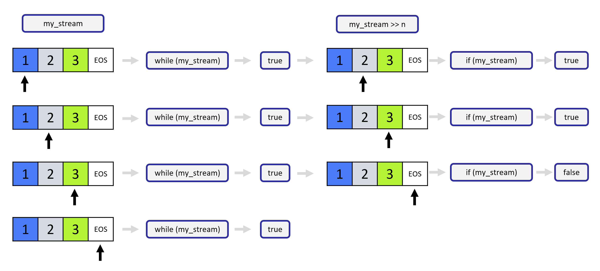

# How to Process Strings

Now that the board is being read into our program line by line, we want to process each line and store the data, rather than just streaming it to `cout`. There are many ways to do this in C++, but we will focus on `istringstream` from the `<sstream>` header file.

## Streaming `int`s from a `string` with `istringstream`

In C++ strings can be streamed into temporary variables, similarly to how files can be streamed into strings. Streaming a string allows us to work with each character individually.

One way to stream a string is to use an **i**nput **string** **stream** object `istringstream` from the `<sstream>` header. 

Once an `istringstream` object has been created, parts of the string can be streamed and stored using the "extraction operator": `>>`. The extraction operator will read until whitespace is reached or until the stream fails. Execute the following code to see how this works:

```cpp
#include <iostream>
#include <sstream>
#include <string>

using std::istringstream;
using std::string;
using std::cout;

int main () 
{
    string a("1 2 3");

    istringstream my_stream(a);

    int n;
    my_stream >> n;
    cout << n << "\n";
}
```

```bash
$ g++ -std=c++17 ./code/string_stream.cpp && ./a.out
1
```

The `istringstream` object can also be used as a boolean to determine if the last extraction operation failed - this happens if there wasn't any more of the string to stream, for example. If the stream still has more characters, we are able to stream again. See the following code for an example of using the `istringstream` this way:

```cpp
#include <iostream>
#include <sstream>
#include <string>

using std::istringstream;
using std::string;
using std::cout;

int main() 
{
    string a("1 2 3");

    istringstream my_stream(a);

    int n;
    
    // Testing to see if the stream was successful and printing results.
    while (my_stream) {
        my_stream >> n;
        if (my_stream) {
            cout << "That stream was successful: " << n << "\n";
        }
        else {
            cout << "That stream was NOT successful!" << "\n";            
        }
    }
}
```

```bash
$ g++ -std=c++17 ./code/string_stream_2.cpp && ./a.out
That stream was successful: 1
That stream was successful: 2
That stream was successful: 3
That stream was NOT successful!
```

Why we need if statement in above, like below image illustration:



After `my_stream >> n`, if we do not have if statement and only `cout << "That stream was successful: " << n << "\n";` , we will still get result `3` that is not what we desired for.

```bash
# Incorrect result, if we don't use inner if statement
That stream was successful: 1
That stream was successful: 2
That stream was successful: 3
That stream was successful: 3
```


The extraction operator `>>` writes the stream to the variable on the right of the operator and returns the `istringstream` object, so the entire expression `my_stream >> n` is an `istringstream` object and can be used as a boolean! Because of this, a common way to use `istringstream` is to use the entire extraction expression in a while loop as follows:

```cpp
#include <iostream>
#include <sstream>
#include <string>

using std::istringstream;
using std::string;
using std::cout;

int main () {
    string a("1 2 3");

    istringstream my_stream(a);
    
    int n;
    
    while (my_stream >> n) {
      cout << "That stream was successful: " << n << "\n";
    }
    cout << "The stream has failed." << "\n";
    
}
```

```bash
$ g++ -std=c++17 ./code/string_stream_3.cpp && ./a.out
That stream was successful: 1
That stream was successful: 2
That stream was successful: 3
The stream has failed.
```

### Strings with Mixed Types

In the stream example above, the string contained only whitespaces and characters which could be converted to `int`s. If the string has mixed types, more care is needed to process the string. In the following example, the type `char` is used, which is a type that can hold only a single ASCII character.

```cpp
#include <iostream>
#include <sstream>
#include <string>

using std::istringstream;
using std::string;
using std::cout;

int main() 
{
    string b("1,2,3");

    istringstream my_stream(b);

    char c;
    int n;

    while (my_stream >> n >> c) {
      cout << "That stream was successful:" << n << " " << c << "\n";
    }
    cout << "The stream has failed." << "\n";
}
```

```bash
$ g++ -std=c++17 ./code/string_stream_example_4.cpp && ./a.out
That stream was successful:1 ,
That stream was successful:2 ,
The stream has failed.
```

In that example, notice that the `3` was not printed! The expression: 
```
my_stream >> n >> c
```
tried to stream an `int` followed by a `char`. Since there was no `char` after the `3`, the stream failed and the `while` loop exited.


## Adding Data to a Vector

Now that we can process a string, we may want to store the results of the processing in a convenient container for later use. In the next exercise, we will store the streamed `int`s from each line of the board in a `vector<int>`. To do this, we add the `int`s to the back of the vector, using the `vector` method `push_back`:

```cpp
#include <vector>
#include <iostream>
using std::vector;
using std::cout;

int main() {
    // Initial Vector
    vector v {1, 2, 3};
    
    // Print the contents of the vector
    for (int i=0; i < v.size(); i++) {
      cout << v[i] << "\n";
    }
    
    // Push 4 to the back of the vector
    v.push_back(4);

    // Print the contents again
    for (int i=0; i < v.size(); i++) {
      cout << v[i] << "\n";
    }
    
}
```

```bash
$ g++ -std=c++17 ./code/string_stream_example_5.cpp && ./a.out
1
2
3
1
2
3
4
```

The `4` has been added to the end of the vector!


## Example: Parse Lines from the File

Now that we are able to read a board line by line from a file, we want to parse these lines and store them in a `vector<int>`

We have included a test in the `main` to ensure that the function is working correctly. If everything works, we should see:

```bash
----------------------------------------------------------
TestParseLine: passed
----------------------------------------------------------
```

see implementation details in [`main.cpp`](./main.cpp) file.
