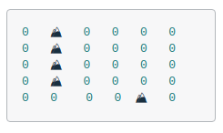

# Formatting the Printed Board



In the previous exercises, we stored and printed the board as a `vector<vector<int>>`, where only two states were used for each cell: `0` and `1`. This is a great way to get started, but as the program becomes more complicated, there will be more than two possible states for each cell. Additionally, it would be nice to print the board in a way that clearly indicates open areas and obstacles, just as the board is printed above.

To do this clearly in your code, we will learn about and use something called an `enum`. An `enum`, short for enumerator, is a way to define a type in C++ with values that are restricted to a fixed range. For an explanation and examples, see the cell below.

## Enums

C++ allows you to define a custom type which has values limited to a specific range you list or "enumerate". This custom type is called an "enum".

Suppose you were writing a program that stores information about each user's car, including the color. You could define a `Color` `enum` in your program, with a fixed range of all the acceptable values: 
- `white`
- `black`
- `blue`
- `red`

This way, you can be sure that each color is restricted to the acceptable set of values.

Here is an example:

```cpp
#include <iostream>
using std::cout;

int main() 
{
    // Create the enum Color with fixed values.
    enum class Color {white, black, blue, red};

    // Create a Color variable and set it to Color::blue.
    Color my_color = Color::blue;

    // Test to see if my car is red.
    if (my_color == Color::red) {
        cout << "The color of my car is red!" << "\n";
    } else {
        cout << "The color of my car is not red." << "\n";
    }
}
```

```bash
$ g++ -std=c++17 ./code/enum_ex_1.cpp && ./a.out
The color of my car is not red
```

**Note:** In the example above, the keyword `enum` is followed by the keyword `class` and then the class name `Color`. This creates what are called "scoped" `enum`s. It is also possible, but [not advisable](https://github.com/isocpp/CppCoreGuidelines/blob/master/CppCoreGuidelines.md#Renum-class), to omit the `class` keyword and thus create "unscoped" `enums`. [More information is available at cppreference.com](https://en.cppreference.com/w/cpp/language/enum).

## Switch

Below is another example of an `enum` being used. Here, a custom type `Direction` is created with four possible values: `kUp`, `kDown`, `kLeft`, `kRight`. One of these values is then stored in a variable and used in the ==switch statement==.

> A `switch` statement in C++ behaves similarly to a sequence of `if` and `else if` statements. The value passed into the `switch` is evaluated against each case. When the matching case is found, the code for that case is executed, and the `break` statement exits the switch. Note that if the `break` is not included, the code for each case following the matching case is executed.

Using a prefix like `k` in `enum` constants is a common convention in C++ to indicate that the identifier is a constant. It stands for "constant" or "constant expression." This helps improve code readability and maintainability, making it clear that these values are not meant to be changed during the program's execution.

```cpp
#include <iostream>
using std::cout;

int main()
{
    enum class Direction {kUp, kDown, kLeft, kRight};

    Direction a = Direction::kUp;

    switch (a) {
      case Direction::kUp : cout << "Going up!" << "\n";
        break;
      case Direction::kDown : cout << "Going down!" << "\n";
        break;
      case Direction::kLeft : cout << "Going left!" << "\n";
        break;
      case Direction::kRight : cout << "Going right!" << "\n";
        break;
    }
}
```

```bash
$ g++ -std=c++17 ./code/enum_ex_2.cpp && ./a.out
Going up!
```

## Example: Formatting the Printed Board

```
0   ⛰️   0   0   0   0
0   ⛰️   0   0   0   0
0   ⛰️   0   0   0   0
0   ⛰️   0   0   0   0
0   0    0   0  ⛰️   0
```

The board will eventually have more than two cell states as the program becomes more complicated, and it would be nice to add formatting to the printed output of the board to ensure readability as the number of board states increases.

To accommodate more board states and facilitate print formatting, we have provided the `State` enum with enumerator values `kEmpty` and `kObstacle`. In this exercise, we will write a `CellString` function which converts each `State` to an appropriate string. In the next exercise, we will update the program to use the `enum` values and `CellString` function.

see implementation details in [`main.cpp`](./main.cpp) file.


# Store the Board Using the State Enum

Now that we have a way to print the `State` `enum` values, you will be able to modify your program to use `State` values in the board exclusively. To do this, we need to modify the return types and variable types in several places of the code. We have clearly marked these with a `Update` in each part of the code.

After this exercise, we will begin coding the main A* search algorithm!


