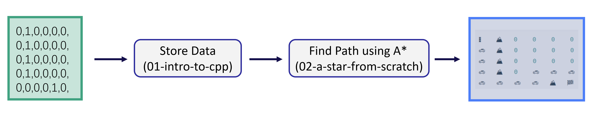
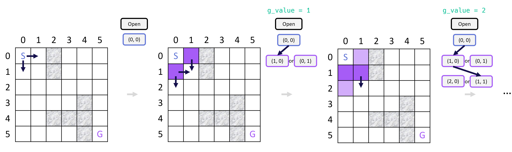
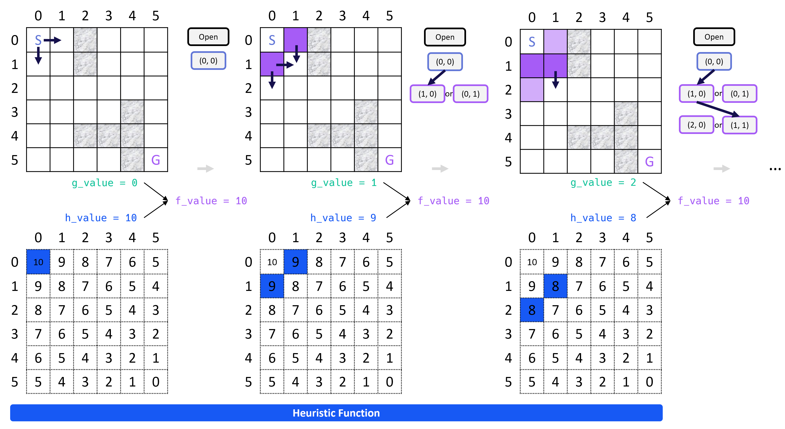
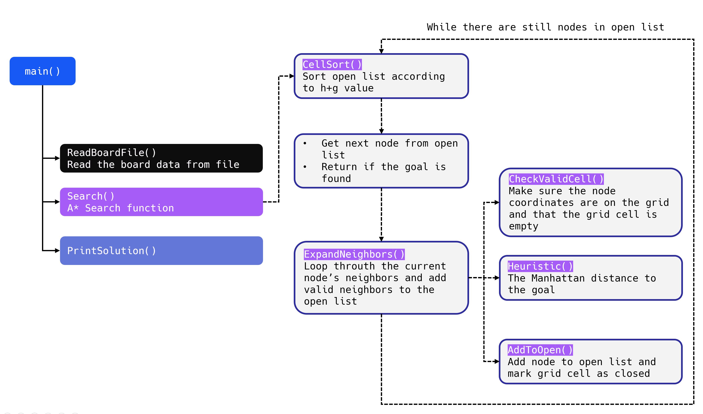
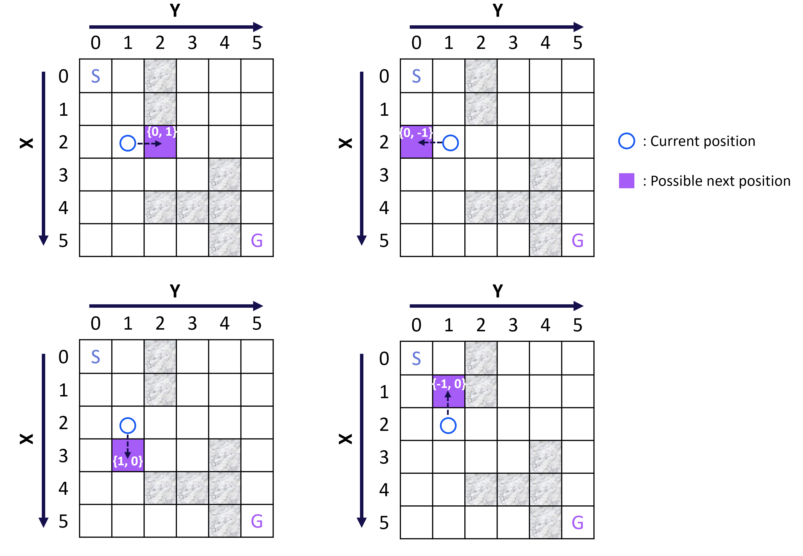

# A* Introduction

This section focuses on the **A* Search algorithm**, a method designed to efficiently **find a path between two points in a grid**. Essentially, it’s a maze-solving algorithm frequently used in pathfinding tasks involving graphs. In this context, a **graph** can be understood as **a collection of nodes connected by edges**.

The A* Search algorithm excels at finding a path, if one exists, between any two nodes in a graph. While the code we’ve worked on so far may not seem directly related to graphs, it actually operates on a two-dimensional grid with obstacles. We can think of this grid as a graph where edges connect nodes that aren't separated by obstacles. From this perspective, the A* Search algorithm becomes an excellent tool for navigating through the grid.

By the end of the section, we’ll be able to print the path connecting the starting and ending points (see right part).



## Planning

**Definition**:

- The process of finding a path from a start to a goal location is called **planning**.
- For robots, this is often referred to as **robot motion planning**.

**Components of the Planning Problem**:

- **Input**: A map of the world, a starting location, a goal location, and a cost function.
- **Cost Function**: Often represents the time required to travel a specific route.
- **Goal**: To find the **minimum-cost path**.

### Motion Planning

A **motion planning**, which involves finding a path for a robot (or vehicle) to move from a starting location to a goal location within a given environment. This problem is relevant to various scenarios, such as robots navigating obstacles or self-driving cars traveling through city streets.

1. **Example**:
   - A robot or car must navigate to a target location while considering obstacles and constraints.
   - For instance, a car at an intersection might need to change lanes, avoid obstacles (e.g., a truck), or take a detour to reach the goal safely.
2. **Challenges**:
   - Certain maneuvers, like lane shifts, can be risky due to limited space or obstacles.
   - Alternative routes, like taking a detour, may sometimes be more feasible.


The problem we're working on sets the stage for exploring discrete motion planning methods and introduces the concept of optimizing paths based on cost.


## Shortest Path Algorithm

A **shortest path** is from a start point to a goal point on a grid using a systematic approach. It introduces the concept of **node expansion** and the use of a **g-value** to track the number of steps taken to reach each node.



**Grid Representation**:

- The grid is divided into rows and columns, with each cell identified by its coordinates (row, column).
- For example, the start point is `(0, 0)`.

**Open List**:

- A list called **open** is used to keep **track of nodes** (grid cells) that need further investigation.
- Initially, the open list contains only the start node `(0, 0)`.

**Node Expansion**:

- Nodes are **expanded** by checking their **neighbors** (adjacent cells, see arrow).
- Once a node is expanded, it is marked as "**checked(purple cell)**" to avoid revisiting it and creating cycles.

**g-Value**:

- The **g-value** represents the **number of steps** (or expansions) required to reach a node from the start point.
- For example:
  - Starting node `(0, 0)` has a g-value of `0`.
  - Its neighbors `(1, 0)` and `(0, 1)` have a g-value of `1`.

**Expansion Process**:

- Always expand the node with the **smallest g-value** from the open list.
- For nodes with the same g-value, any of them can be expanded first.
- When expanding a node:
  - Add its **unchecked** neighbors to the open list.
  - Ignore neighbors that are already checked or revisited.

**Termination**:

- The process continues until the goal node is reached.
- The **g-value** of the goal node will represent the **shortest path length** (number of steps).

**Key Principle**:

- The algorithm guarantees the shortest path because it always expands nodes in order of their smallest g-value.


## A* Search

**A-star (A*)** is a powerful and efficient search algorithm that **improves upon basic search methods** like breadth-first search by using a **heuristic function** to guide the search process. A-star is widely used in robotics, pathfinding, and AI. because it significantly reduces the number of node expansions while still guaranteeing the shortest path.

### Overview

- A-star is a search algorithm that uses a combination of **g-values** (cost to reach a node) and **heuristic values (h-values)** (estimated cost to the goal).
- It always expands the node with the smallest **f-value**, where:
  - **f = g + h**
  - **g**: **Number of steps** or cost to reach the node from the start.
  - **h**: **Heuristic estimate** of the remaining cost to the goal.

1. **Differences from Basic Search**:
   - In basic search (like breadth-first search), nodes are expanded based **solely on their g-values.**
   - A-star **incorporates a heuristic (h-value) to prioritize nodes** that are closer to the goal, **reducing unnecessary expansions**.
2. **Heuristic Function (h)**:
   - The heuristic function estimates the distance or cost from a node to the goal.
   - It must be **optimistic**, meaning it should never overestimate the actual cost (i.e., **h ≤ true cost**).
   - A common heuristic is the **Manhattan distance** (if movement is restricted to horizontal/vertical) or **Euclidean distance** (if diagonal movement is allowed).
3. **How A-star Works**:
   - **Initialization**: Start with the initial node in the open list. Compute its f-value as `f = g + h`.
   - **Expansion**: Expand the node with the smallest f-value in the open list.
   - **Neighbor Evaluation**:
     - For each neighbor, calculate its g-value (increment by 1) and f-value (`f = g + h`).
     - Add unchecked neighbors to the open list.
   - **Repeat**: Continue expanding nodes with the smallest f-value until the goal is reached.
   - **Termination**: The g-value of the goal node represents the shortest path length.
4. **Key Features**:
   - **Efficiency**: A-star **reduces** the number of **expanded nodes** compared to basic search algorithms.
   - **Optimality**: If the heuristic is admissible (optimistic), A-star guarantees the shortest path.
   - **Flexibility**: The heuristic can be tailored to the specific problem domain.

### Illustration



1. **Initial Setup**:
   - Start node: `(0, 0)`
   - Goal node: `(5, 5)`
   - Heuristic values (`h`) are precomputed (e.g., Manhattan distances to the goal).

2. **Expansion Process**:
   - At each step, the algorithm selects the node with the smallest **f-value** (g + h).
   - Nodes closer to the goal (based on the heuristic) are prioritized.

3. **Heuristic Influence**:
   - The heuristic helps the algorithm avoid unnecessary areas (e.g., obstacles or irrelevant open spaces).
   - If an obstacle is placed near the goal, A-star **adjusts the path dynamically** while still minimizing expansions.

4. **Final Path**:
   - The algorithm terminates when the goal node is expanded.
   - The g-value of the goal node represents the shortest path length.


### Pseudocode

> **Search**( *grid*, *initial_point*, *goal_point* ) :
>
> 1. Initialize an empty list of open nodes.
>
> 2. Initialize a starting node with the following:
>
>    * `x` and `y` values given by initial_point.
>
>    - **g_value** = 0, where g is the cost for each move.
>    - **h_value** given by the heuristic function (a function of the current coordinates and the goal).
>
> 3. Add the new node to the list of open nodes.
>
> 4. **while** the list of open nodes is nonempty:
>
>    1. Sort the open list by **f_value**, which is equal to the summation of the **g_value** and the **h_value**.
>
>    2. Pop the optimal cell (called the *current* cell).
>
>    3. Mark the cell's coordinates in the grid as part of the path.
>
>    4. **if** the *current* cell is the goal cell:
>
>       - return the grid.
>
>    5. else, expand the search to the current node's neighbors. This includes the following steps:
>
>       - Check each neighbor cell in the grid to ensure that the cell is empty: it hasn't been closed and is not an obstacle.
>       - If the cell is empty, compute the cost (g_value) and the heuristic, and add to the list of open nodes.
>
>       - Mark the cell as closed.
>
> 5. If you exit the while loop because the list of open nodes is empty, you have run out of new nodes to explore and haven't found a path.

The `A* search` algorithm finds a path from the **start node** to the **end node** by checking for **open** **neighbors** of the current node, **computing a heuristic** for each of the neighbors, and **adding those neighbors** to the list of open nodes to explore next. The **next node** to explore is the one with the **lowest total cost + heuristic** (g + h). This process is repeated until the end is found, as long as there are still open nodes to explore.

## Code Structure



The code for the A* search algorithm has been broken down into the following functions:

- `CellSort()` - sorts the open list according to the sum of h + g
- `ExpandNeighbors()` - loops through the current node's neighbors and calls appropriate functions to add neighbors to the open list
- `CheckValidCell()` - ensures that the potential neighbor coordinates are on the grid and that the cell is open
- `Heuristic()` - computes the distance to the goal
- `AddToOpen()` - adds the node to the open list and marks the grid cell as closed


## Walkthrough

### Step 1: Starting A* Search: `Search`

To get started with writing the A* search algorithm, we first add a `Search` function stub that accepts and returns the appropriate variable types.

see implementation detail in [here](./01-starting-astar-search/main.cpp)

###  Step 2: A* Heuristic: `Heuristic`

We write a `Heuristic` function that will be used to guide the A* search. In general, any [admissible function](https://en.wikipedia.org/wiki/Admissible_heuristic) can be used for the heuristic, but for this project, you will write one that takes a pair of 2D coordinates on the grid and returns the [Manhattan Distance](https://en.wikipedia.org/wiki/Taxicab_geometry) from one coordinate to the other.

see implementation detail in [here](./02-writing-the-astar-heuristic/main.cpp)

### Step 3: Adding Nodes to the Open Vector: `AddToOpen`

As you've seen from above explanation of `A *search`, the search algorithm keeps a list of potential board cells to search through. In this implementation of A*, we will refer to a board cell along with it's **`g`** and **`h`** values as a *node*. In other words, each node will consist of the following values which are needed for the `A* search` algorithm:

- an **x** coordinate,
- a **y** coordinate,
- the **g** value (or *cost*) that has accumulated up to that cell,
- the **h** value for the cell, given by the heuristic function.

In the code, nodes will be implemented with the type `vector<int>`, and should have the form `{x, y, g, h}` for `int`s x, y, g, and h. Also, the open list will be implemented as a C++ vector (of type `vector<vector<int>>`). The goal in this exercise is to write a helper function for our A* Search which will add nodes to the open vector and mark them as visited in the grid.

see implementation detail in [here](./03-adding-nodes-to-the-open-vector/main.cpp)

> ## Pass by Reference
>
> In the previous exercises, we've written functions that accept and return various kinds of objects. However, in all of the functions we've written so far, the objects returned by the function are different from the objects provided to the function. In other words, when the function is called on some data, a copy of that data is made, and the function operates on a copy of the data instead of the original data. This is referred to as **pass by value**, since only a copy of the values of an object are passed to the function, and not the actual objects itself.
>
> To see how to use a function to operate directly on a given object, have a look at the cell below.
>
> ```cpp
> #include <iostream>
> using std::cout;
> 
> 
> int MultiplyByTwo(int i) {
>     i = 2*i;
>     return i;
> }
> 
> int main() {
>     int a = 5;
>     cout << "The int a equals: " << a << "\n";
>     int b = MultiplyByTwo(a); // 10
>     cout << "The int b equals: " << b << "\n";
>     cout << "The int a still equals: " << a << "\n";
> }
> $ g++ -std=c++14 ./code/pass_by_value.cpp && ./a.out
> The int a equals: 5
> The int b equals: 10
> The int a still equals: 5
> ```
>
> In the code above, `a` is **passed by value** to the function, so the variable `a` is not affected by what happens inside the function.
>
> But what if we wanted to change the value of `a` itself? For example, it might be that the variable you are passing into a function maintains some state in the program, and you want to **write the function to update that state.** 
>
> It turns out, it is possible to **modify `a` from within the function**. To do this, you must pass a _reference_ to the variable `a`, instead of the _value_ of `a`. In C++, _a reference is just an alternative name for the same variable_.
>
> To pass by reference, you simply need to **add an ampersand `&` before the variable** in the function declaration. Try the code below to see how this works:
>
> ```cpp
> #include <iostream>
> using std::cout;
> 
> 
> int MultiplyByTwo(int &i) {
>     i = 2*i;
>     return i;
> }
> 
> int main() {
>     int a = 5;
>     cout << "The int a equals: " << a << "\n";
>     int b = MultiplyByTwo(a);
>     cout << "The int b equals: " << b << "\n";
>     cout << "The int a now equals: " << a << "\n";
> }
> $ g++ -std=c++14 ./code/pass_by_reference.cpp && ./a.out
> The int a equals: 5
> The int b equals: 10
> The int a now equals: 10
> ```
>
> In the code above, `a` is **passed by reference** to the function `MultiplyByTwo` since the argument to `MultiplyByTwo` is a reference: `&i`. This means that `i` is becomes another name for whatever variable that is passed into the function. When the function changes the value of `i`, then the value of `a` is changed as well.
>
> In the next exercises we will write some functions that require passing variables by reference. This will allow helper functions in the A* search program to **modify the state of the board without having to copy the entire board**, for instance.
>
> Note that if you've encountered references before in C++, you are aware that they can be used in many other scenarios, aside from just passing variables to functions. In the next sections, we will learn about references more generally, along with closely related ***pointers***. 


### Step 4: Initialize the Open Vector: `Search`

We will begin implementing the body of the `Search` function. In particular, we will take the arguments that are passed to the search function, get the `x`, `y`, `g`, and `h` values for the first node, and then add the first node to the open vector.

see implementation detail in [here](./04-initialize-the-open-vector/main.cpp)


### Step 5: Create a Comparison Function: `Compare`

Before we use the vector of open nodes to expand the A* search, we first need to sort the vector. Since the vector contains nodes `{x, y, g, h}`, and there is no standard library function to sort these types of vectors, we will begin by writing a function which compares two nodes to determine their order.

This function is a helper function for the `CellSort()` function we will write in below file

see implementation detail in [here](./05-create-a-comparison-function/main.cpp)


### Step 6: While Loop for the A* Algorithm: `Search`

Now on to some of the core functionality of the A *search algorithm. A* search works by sorting the open list using the f-value, and using the node with the lowest f-value as the next node in the search. This process continues until the goal node has been found or the open list runs out of nodes to use for searching.

In this part, we will implement the primary `while` loop in the algorithm which carries out the process described above

```
// TODO: while open vector is non empty {

    // TODO: Sort the open list by calling `CellSort`. `CellSort` method will sort the open list in a descending order to have the node with the lowest heuristic value at the end of the vector.

// TODO: When we call the `CellSort` method, we need to pass the memory address of the open vector like that: CellSort(&open) because the argument of the CellSort method is a pointer to a vector.

    // TODO: get the last node from the open vector using the '.back()` method and save it to the variable `current_node`.

    // TODO: remove the last node from the open vector using the`.pop_back()` method.

    // TODO: Get the x and y values from the `current_node`,
    // and set grid[x][y] to kPath.

    // TODO: Check if you've reached the goal. If so, return grid.

    // If we're not done, expand search to current node's neighbors. This step will be completed in a later part.
    // ExpandNeighbors

  //} 

// TODO: End while loop
```

**Note:** We've included a header and a function to sort the open vector:

- `#include <algorithm>`
- `std::sort`
- `CellSort`

The `CellSort` function uses the `Compare` function we wrote previously to determine the sorting order. The `CellSort` function contains two operators that we haven't seen before: `*` and `->`. These operators have to do with C++ pointers, which we will cover this in the next sections. Don't worry about them for now!

see implementation detail in [here](./06-write-a-while-loop-for-the-astar-algorithm/main.cpp)


### Step 7: Check for Valid Neighbors: `CheckValidCell`

The last part of the A\* algorithm to be implemented is the part that adds neighboring nodes to the open vector. In order to expand our A* search from the current node to neighboring nodes, we first need to check that neighboring grid cells are **not closed**, and that they are **not an obstacle**. In this part, we will write a function `CheckValidCell` that does exactly this.

see implementation detail in [here](./07-check-for-valid-neighbors/main.cpp)


### Extra: Constants

In [*A Tour of C++*](http://www.stroustrup.com/Tour.html), Bjarne Stroustrup writes:

> C++ supports two notions of immutability:
>
> - `const`: meaning roughly " I promise not to change this value."...The compiler enforces the promise made by `const`....
> - `constexpr`: meaning roughly "to be evaluated at compile time." This is used primarily to specify constants...

This example highlights how to use `const` to promise not to modify a variable, even though the variable can only be evaluated at run time.

The example also show how to use `constexpr` to guarantee that a variable can be evaluated at compile time.

```cpp
#include <iostream>

int main()
{
    int i;
    std::cout << "Enter an integer value for i: ";
    std::cin >> i;
    const int j = i * 2;  // "j can only be evaluated at run time."
                          // "But I promise not to change it after it is initialized."
    
    constexpr int k = 3;  // "k, in contrast, can be evaluated at compile time."
    
    std::cout << "j = " << j << "\n";
    std::cout << "k = " << k << "\n";
}
```

```bash
$ g++ -std=c++17 ./code/const1.cpp && ./a.out
Enter an integer value for i: 4
j = 8
k = 3
```

We can see another example([llama.cpp line at 4948-4949](https://github.com/ggerganov/llama.cpp/blob/master/src/llama.cpp)) in real application.

```cpp
constexpr size_t n_buffers = 4;
constexpr size_t buffer_size = 1 * 1024 * 1024; // 1MB
```

If you want to change a `const` variable, you will get a error:

```cpp
int main()
{
    const int i = 2; // "I promise not to change this."
    i++;             // "I just broke my promise."
}
```

```bash
$ g++ -std=c++17 ./code/const2.cpp && ./a.out
./code/const2.cpp: In function ‘int main()’:
./code/const2.cpp:4:6: error: increment of read-only variable ‘i’
     i++;             // "I just broke my promise."
      ^~
```

Similarly, the compiler will catch a `constexpr` variable that changes.

```cpp
int main()
{
    constexpr int i = 2;  // "i can be evaluated at compile time."
    i++;                  // "But changing a constexpr variable triggers an error."
}
```

```bash
$ g++ -std=c++17 ./code/const3.cpp && ./a.out
./code/const3.cpp: In function ‘int main()’:
./code/const3.cpp:4:6: error: increment of read-only variable ‘i’
     i++;                  // "But changing a constexpr variable triggers an error."
      ^~
```

The major difference between `const` and `constexpr`, though, is that `constexpr` must be evaluated at compile time.

The compiler will catch a `constexpr` variable that cannot be evaluated at compile time.

```cpp
#include <iostream>

int main()
{
    int i;
    std::cout << "Enter an integer value for i: ";
    std::cin >> i;
    constexpr int j = i * 2;  // "j can only be evaluated at run time."
                              // "constexpr must be evaluated at compile time."
                              // "So this code will produce a compilation error."
}
```

```bash
$ g++ -std=c++17 ./code/const4.cpp && ./a.out
./code/const4.cpp: In function ‘int main()’:
./code/const4.cpp:8:27: error: the value of ‘i’ is not usable in a constant expression
     constexpr int j = i * 2;  // "j can only be evaluated at run time."
                           ^
./code/const4.cpp:5:9: note: ‘int i’ is not const
     int i;
         ^
```

A common usage of `const` is to guard against accidentally changing a variable, especially when it is **passed-by-reference** as a function argument.

```cpp
#include <iostream>
#include <vector>

int sum(const std::vector<int>& v)
{
    int sum = 0;
    for(int i : v)
        sum += i;
    return sum;
}

int main()
{
    std::vector<int> v {0, 1, 2, 3, 4};
    std::cout << sum(v) << "\n";
}
```

```bash	
$ g++ -std=c++17 ./code/const5.cpp && ./a.out
10
```

**Summary:**

- **`const`**: Best used for variables that should not be modified after initialization but whose values are **only known at runtime** (e.g., function parameters, **configuration** values).  
- **`constexpr`**: Best used for values that must be evaluated at compile time, such as **array sizes, template parameters**, or **constants** used for optimization.
- The distinction between `const` and `constexpr` is subtle. In general, though, `const` is much more common than `constexpr`.
- When in doubt, use `const`, especially to **guard against accidentally modifying** a variable.


### Step 8: Expand the A* Search to Neighbors

We have now reached the final step of the A* algorithm! We now expand our A* search to neighboring nodes and add valid neighbors to the open vector. In this part, we will write an `ExpandNeighbors` function that takes care of this functionality.

> pseudocode below:
>
> ```
> // TODO: ExpandNeighbors {
> 
>   // TODO: Get current node's data.
> 
>   // TODO: Loop through current node's potential neighbors.
> 
>     // TODO: Check that the potential neighbor's x2 and y2 values are on the grid and not closed.
> 
>       // TODO: Increment g value, compute h value, and add neighbor to open list.
> 
> // } TODO: End function
> ```
>
> **Note:** we have provided directional deltas in the form of a 2D [array](https://www.programiz.com/cpp-programming/arrays). An array is a C++ container much like a vector, although **without the ability to change size** after initialization. Arrays can be accessed and iterated over just as vectors.

In the part, we can iterate over these `delta` values to check the neighbors in each direction:



```
// directional deltas
const int delta[4][2]{{-1, 0}, {0, -1}, {1, 0}, {0, 1}};
```

see implementation detail in [here](./08-expand-the-astar-search-to-neighbors/main.cpp)


### Extra: Arrays

Arrays are a **lower level** data structure than vectors, and can be **slightly more efficient**, in terms of memory and element access. However, this efficiency comes with a price. Unlike vectors, which can be extended with more elements, **arrays have a fixed length**. Additionally, **arrays may require careful memory management**, depending how they are used.

The example in the project code is a good use case for an array, as it was not intended to be changed during the execution of the program. However, a vector would have worked there as well.


### Step 9: Adding a Start and End to the Board

Now, A* search algorithm is fully functional. To wrap things up, there is one modification that can be made to the project to make the printout slightly clearer. At this point, our program should print the following:

```
🚗   ⛰️    0    0    0    0   
🚗   ⛰️    0    0    0    0   
🚗   ⛰️    0    0    0    0   
🚗   ⛰️    0   🚗   🚗   🚗   
🚗   🚗   🚗   🚗   ⛰️   🚗 
```

This is fantastic, but it isn't clear where the beginning and end of the path are. In this exercise, we will add a `🚦` for the beginning of the path, and a `🏁` for the end.

