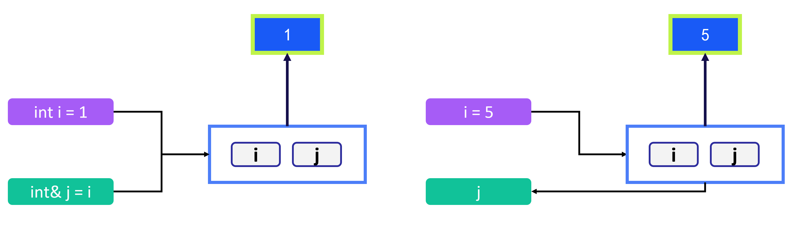
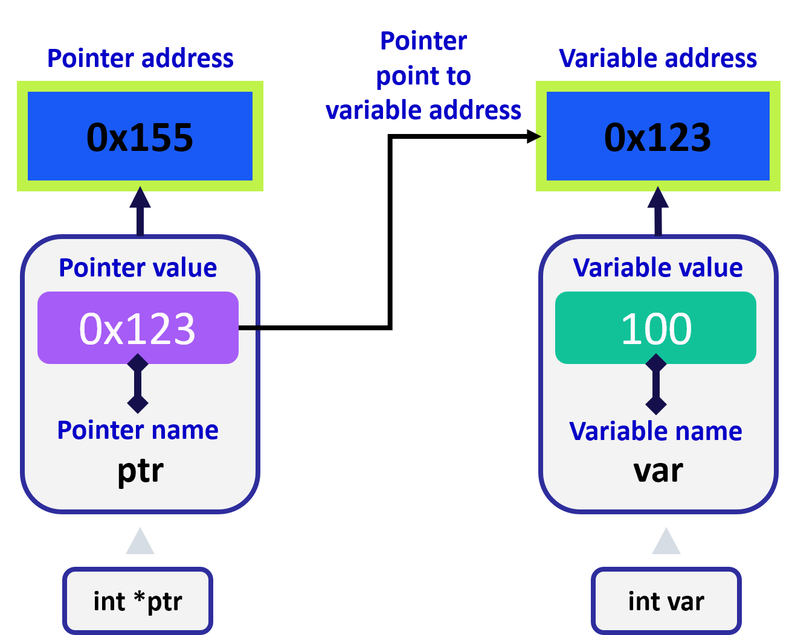
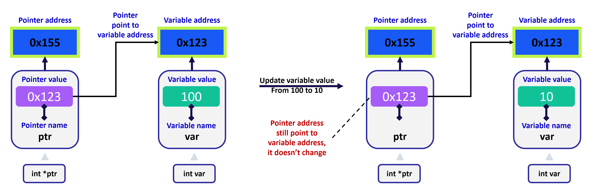

# File Orchestration

## Introduction

So far, all code has been written in a single file, which is suitable for small programs or prototyping. As programs grow larger, organizing code into multiple files becomes necessary, similar to practices in other programming languages.

**Topics Covered**:

- **Header files:** Using headers to break a single file into multiple files
- **Build Systems**: Introduction to tools like CMake and Make, which help efficiently build large programs.
- **Advanced Tools and Concepts**: Explore references, pointers, maps, classes, and a bit of object-oriented programming (OOP) in C++.


## Header Files

Header files, or `.h` files, allow related function, method, and class **declarations** to be collected in one place. The corresponding **definitions** can then be placed in `.cpp` files. The compiler considers a header declaration a "**promise**" that the definition will be found later in the code, so if the compiler reaches a function that hasn't been defined yet, it can continue on compiling until the definition is found. This allows functions to be defined (and declared) in **arbitrary order**.

### Function Order in a Single File

In the following code example, the functions are out of order, and the code will not compile.

```cpp
#include <iostream>
using std::cout;

void OuterFunction(int i) 
{
    InnerFunction(i);
}

void InnerFunction(int i) 
{
    cout << "The value of the integer is: " << i << "\n";
}

int main() 
{
    int a = 5;
    OuterFunction(a);
}
```

```bash
$ g++ -std=c++17 ./code/out_of_order.cpp && ./a.out
./code/out_of_order.cpp: In function ‘void OuterFunction(int)’:
./code/out_of_order.cpp:6:5: error: ‘InnerFunction’ was not declared in this scope
     InnerFunction(i);
     ^~~~~~~~~~~~~
./code/out_of_order.cpp:6:5: note: suggested alternative: ‘OuterFunction’
     InnerFunction(i);
     ^~~~~~~~~~~~~
     OuterFunction
```

After we change the order of `InnerFunction`, we can successfully run it.

```cpp
#include <iostream>
using std::cout;

// move above
void InnerFunction(int i) 
{
    cout << "The value of the integer is: " << i << "\n";
}

void OuterFunction(int i) 
{
    InnerFunction(i);
}

int main() 
{
    int a = 5;
    OuterFunction(a);
}
```

```bash
$ g++ -std=c++17 ./code/out_of_order.cpp && ./a.out
The value of the integer is: 5
```

In the previous part we already implemented, we were very careful to indicate where each function should be placed, so we didn't run into the problem of functions being out of order.

### Using a Header

One other way to solve the code problem above (==without rearranging the functions==) would have been to **declare each function at the top of the file**. A function declaration is much like the first line of a function definition - it contains the return type, function name, and input variable types. The **details of the function definition are not needed for the declaration though.**

T**o avoid a single file from becoming cluttered** with declarations and definitions for every function, **it is customary to declare the functions in another file**, called the **header file**. In C++, the header file will have filetype `.h`, and the contents of the header file must be included at the top of the `.cpp` file. See the following example for a refactoring of the code above into a header and a `.cpp` file.

`header_example.h`

```cpp
// The header file with just the function declarations and be saved as header_example.h.
#ifndef HEADER_EXAMPLE_H
#define HEADER_EXAMPLE_H

void OuterFunction(int);
void InnerFunction(int);

#endif
```

`corresponding.cpp`

```cpp
// The contents of header_example.h are included in 
// the corresponding.cpp file using quotes:
#include "header_example.h"

#include <iostream>
using std::cout;

void OuterFunction(int i) 
{
    InnerFunction(i);
}

void InnerFunction(int i) 
{
    cout << "The value of the integer is: " << i << "\n";
}

int main() 
{
    int a = 5;
    OuterFunction(a);
}
```

```bash
$ g++ -std=c++17 ./code/header_example.cpp && ./a.out
The value of the integer is: 5
```

Notice that the code from the first example was fixed **without having to rearrange the functions**! In the code above, you might also have noticed several other things:
- The **function declarations in the header file don't need variable names**, just variable types. **You can put names in the declaration, however, and doing this often makes the code easier to read**.
- The `#include` statement for the header used **quotes** `" "` around the file name, and **not angle brackets** `<>`. We have **stored the header in the same directory** as the `.cpp` file, and the **quotes tell the preprocessor to look for the file in the same directory as the current file** - not in the usual set of directories where libraries are typically stored.
- Finally, there is a preprocessor directive:
  ```cpp
  #ifndef HEADER_EXAMPLE_H
  #define HEADER_EXAMPLE_H
  ```
  at the top of the header, along with an `#endif` at the end. This is called an "include guard". Since the header will be included into another file, and `#include` just pastes contents into a file, the include guard prevents the same file from being pasted multiple times into another file. **This might happen if multiple files include the same header,** and then are all included into the same `main.cpp`, for example. 
  The `ifndef` checks if `HEADER_EXAMPLE_H` has not been defined in the file already. If it has not been defined yet, then it is defined with `#define HEADER_EXAMPLE_H`, and the rest of the header is used. If `HEADER_EXAMPLE_H` has already been defined, then the preprocessor does not enter the `ifndef` block.
  **Note:** There are other ways to do this. Another common way is to use an `#pragma once`preprocessor directive, but we won't cover that in detail here. See [this Wikipedia article](https://en.wikipedia.org/wiki/Include_guard) for examples.

>We can take a another example in `llama.cpp` project:
>
>`aclnn_ops.h`
>
>```cpp
>// Executes matrix multiplication for the given tensor.
>void ggml_cann_mul_mat(ggml_backend_cann_context& ctx, ggml_tensor* dst);
>```
>
>`aclnn_ops.cpp`
>
>```cpp
>void ggml_cann_mul_mat(ggml_backend_cann_context& ctx, ggml_tensor* dst) {
>    const enum ggml_type type = dst->src[0]->type;
>    switch (type) {
>        case GGML_TYPE_F32:
>        case GGML_TYPE_F16:
>            ggml_cann_mat_mul_fp(ctx, dst);
>            break;
>        case GGML_TYPE_Q4_0:
>        case GGML_TYPE_Q8_0:
>            ggml_cann_mul_mat_quant(ctx, dst, type);
>            break;
>        default:
>            GGML_ABORT("fatal error");
>            break;
>    }
>}
>```


In the previous concept, we saw how header files could be useful for separating definitions from declarations, so that we don't need to be too careful about the order in which functions are defined. Using header files is typically the first step in creating a multi-file program. In this concept, we will cover things about using multiple `.cpp` and `.h` files in a program - how to compile all the files together, and how to ensure the code from one file can be used in another.

### Example: Multi-file Code

In the next few cells these functions have been separated into several different files. The structure of the included files is as follows:

> `vect_add_one` --> `increment_and_sum` -->`main`

`vect_add_one.h` 

```cpp
#ifndef VECT_ADD_ONE_H
#define VECT_ADD_ONE_H

#include <vector>
using std::vector;

// AddOneToEach method declaration.
void AddOneToEach(vector<int> &v);

#endif
```

`vect_add_one.cpp`

```cpp
#include "vect_add_one.h"
#include <vector>
using std::vector;

void AddOneToEach(vector<int> &v) {
    for (auto& i: v) {
        i++;
    }
}
```

`increment_and_sum.h` 

```cpp
#ifndef INCREMENT_AND_SUM_H
#define INCREMENT_AND_SUM_H

#include <vector>
using std::vector;

// IncrementAndComputeVectorSum method declaration.
int IncrementAndComputeVectorSum(vector<int> v);

#endif
```

`increment_and_sum.cpp`

```cpp
#include "vect_add_one.h"
#include "increment_and_sum.h"

#include <vector>
using std::vector;

int IncrementAndComputeVectorSum(vector<int> v) {
    int total = 0;
    AddOneToEach(v);

    for (auto i: v) {
        total += i;
    }
    return total;
}
```

`main.cpp`

```cpp
#include <iostream>
#include <vector>
#include "increment_and_sum.h"
using std::vector;
using std::cout;

int main() 
{
    vector<int> v{1, 2, 3, 4};
    int total = IncrementAndComputeVectorSum(v);
    cout << "The total is: " << total << "\n";
}
```

After run it, we can see everything on the track.

```bash
$ g++ -std=c++17 ./main.cpp ./increment_and_sum.cpp ./vect_add_one.cpp && ./a.out
The total is: 14
```

If you look carefully at the files above, you will see several things:
- `vect_add_one.h` is included in `increment_and_sum.cpp`.

  >This is because `AddOneToEach` is used in `IncrementAndComputeVectorSum`. Including the `vect_add_one.h` header means that the `AddOneToEach` function declaration is pasted into `increment_and_sum.cpp`, so no compiler error will occur when the `AddOneToEach` function is used.
  
- Only the header file needs to be included in another file. 

  >As long as the header file is included, the corresponding function declarations will be included. When the compiler finds an undefined function, it has already seen the function's declaration. This means the compiler can continue on without error until it finds the definition of the function, regardless of where that definition is.
  
- Some libraries, like `<vector>` are included in multiple files.

  >Each file is **compiled alone** and must have all the declarations and libraries necessary to compile, so the necessary libraries must be included. This is another reason why [include guards](https://github.com/isocpp/CppCoreGuidelines/blob/master/CppCoreGuidelines.md#Rs-guards) are important - if multiple headers were included in `main`, each with the same `#include <vector>` statement, you wouldn't want the `vector` header pasted multiple times into the code.
  
- The `g++` compile command from the "Run Code" button is:

  ```bash
  g++ -std=c++17 ./code/main.cpp ./code/increment_and_sum.cpp ./code/vect_add_one.cpp && ./a.out
  ```

  >When compiling, each of the relevant `.cpp` files must be included in the compile command. The `-std=c++17` specifies that we are using the C++ 17 standard (which happens automatically in the terminal).

see details in this [folder](./01-using-headers-with-multiple-files/)


## CMake and Make

In the previous notebook, we saw how example code could be split into multiple `.h` and `.cpp` files, and we used `g++` to build all of the files together. For small projects with a handful of files, this works well. But what would happen if there were hundreds, or even thousands, of files in the project? We could type the names of the files at the command line each time, but there tools to make this easier.

Many larger C++ projects use a [build system](https://en.wikipedia.org/wiki/List_of_build_automation_software) to manage all the files during the build process. The build system allows for large projects to be compiled with a few commands, and build systems are able to do this in an efficient way by only recompiling files that have been changed.

In this part, we will cover:

- **Object files**: what actually happens when we run `g++`.
- How to use object files to compile only a single file at a time. If we have many files in a project, this will allow us can **compile only files that have changed** and need to be re-compiled.
- How to use `cmake` (and `make`), a build system which is popular in [large C++ projects](https://cmake.org/success/). CMake will simplify the process of building project and **re-compiling only the changed files**.

### Object Files

When we compile a project with `g++`, `g++` actually performs several distinct tasks:


1. The **preprocessor** runs and executes any statement beginning with a hash symbol: `#`, such as `#include` statements. This ensures all code is in the **correct location** and ready to compile.
2. Each file in the source code is **compiled** into an "**object file**" (a `.o` file). Object files are **platform-specific machine code** that **will be used to create an executable**.
3. The object files are **"linked" together** to make a **single executable**. In the examples we have seen so far, this **executable** is `a.out`, but we can specify whatever name we want.

It is possible to have `g++` **perform each of the steps separately** by using the `-c` flag. For example,

```bash
g++ -c main.cpp
```

will produce a `main.o` file, and that file can be converted to an executable with

```bash
g++ main.o
```


### Example: Compiling One File of Many

#### Step 1

In the previous example, we compiled a single source code file to an object file, and that object file was then converted into an executable.

Now we are going to try the same process with multiple files. Suppose we have a directory should have the `increment_and_sum` and `vect_add_one` files from a previous Notebook. We can compiling with the commands below:

```bash
$ g++ -c *.cpp
$ g++ *.o
$ ./a.out
```

Here, the `*` operator is a wildcard, so any matching file is selected. If we compile and run these files together, the executable should print:

```bash
The total is: 14
```

#### Step 2

But what if we make changes to our code and we need to re-compile? In that case, we can compile only the file that we changed, and we can use the existing object files from the unchanged source files for linking.

We can changing the code in `main.cpp` to have different numbers in the vector by extend `5`.

```cpp
#include <iostream>
#include <vector>
#include "increment_and_sum.h"
using std::vector;
using std::cout;

int main() 
{
    vector<int> v{1, 2, 3, 4, 5};
    int total = IncrementAndComputeVectorSum(v);
    cout << "The total is: " << total << "\n";
}

```

When you have done that, re-compile just `main.cpp` by running:

```bash
$ g++ -c main.cpp
$ g++ *.o
$ ./a.out
```

```bash
The total is: 20
```

Compiling just the file you have changed saves time if there are many files and compilation takes a long time. However, the process above is **tedious** when using many files, especially if you **don't remember** which ones you have modified.

For larger projects, it is helpful to use a build system which can compile exactly the right files for you and take care of linking.


### CMake and Make

CMake is an **open-source**, **platform-independent** build system. CMake uses text documents, denoted as `CMakeLists.txt` files, to manage build environments, like [make](https://en.wikipedia.org/wiki/Make_(software)). A comprehensive tutorial on CMake would require an entire course, but we can cover the basics of CMake here.

`CMakeList.txt` files are simple text configuration files that tell CMake how to build your project. There can be multiple `CMakeLists.txt` files in a project. In fact, one `CMakeList.txt` file can be included in each directory of the project, indicating how the files in that directory should be built.

These files can be used to **specify the locations** of necessary packages, set **build flags** and **environment variables**, specify **build target names** and **locations**, and other actions.

we are going to create a basic `CMakeLists.txt` file to build a small project.

### Example: Create a CMakeLists.txt

#### Step 1: Specify cmake & c++ version

In this [folder](./02-cmake-and-make), we have a subfolder called `cmake_example`. This folder should contain a simple CMake project, including:

- An `CMakeLists.txt` file
- A `src` directory with the `increment_and_sum` and `vect_add_one` files from a previous Notebook

We will walkthrough this basic `CMakeLists.txt` file to understand how to build all of these project files into an executable.

The first lines in `CMakeLists.txt` are lines that specifies the **minimum versions of cmake** and C++ required to build the project. Add the following lines to your `CMakeLists.txt` and save the file:

```cmake
cmake_minimum_required(VERSION 3.28.3)

set(CMAKE_CXX_STANDARD 17)
```

These lines set the minimum cmake version required to 3.28.3 and set the environment variable `CMAKE_CXX_STANDARD` so CMake uses C++ 17.

#### Step 2: Set the project name

CMake requires that we name the project, for example, we name this project as `demo`, and then add the following line to `CMakeLists.txt`:

```cmake
project(demo)
```

#### Step 3: Connect executable to source files

Next, we want to add an executable to this project. We can do that with the `add_executable` command by specifying the executable name, along with the locations of all the source files that we will need. CMake has the ability to automatically find source files in a directory, but for now, we can just specify each file needed:

```cmake
add_executable(demo src/main.cpp src/increment_and_sum.cpp src/vect_add_one.cpp)
```

Note: The source files we need are the *three* .cpp files in the `src/` directory.

#### Step 4: Create build folder and build

A typical CMake project will have a `build` directory in the same place as the top-level `CMakeLists.txt`. Make a `build` directory in the `cmake_example` folder:

```bash
$ mkdir build && cd build
```

From within the build directory, we can now run CMake as follows:

```bash
$ cmake ..
$ make
```

The first line directs the `cmake` command at the top-level `CMakeLists.txt` file with `..`. This command uses the `CMakeLists.txt` to configure the project and create a [`Makefile`](https://en.wikipedia.org/wiki/Makefile) in the `build` directory.

```bash
cmake_example/build$ ll
-rwxrwxrwx 1 tim tim 14531 Dec  2 14:28 CMakeCache.txt
drwxrwxrwx 1 tim tim  4096 Dec  2 14:28 CMakeFiles
-rwxrwxrwx 1 tim tim  7419 Dec  2 14:28 Makefile
-rwxrwxrwx 1 tim tim  1770 Dec  2 14:28 cmake_install.cmake
```

In the second line, `make` finds the `Makefile` and uses the instructions in the `Makefile` to build the project.

After CMake and Make are successful, we could see something like the following output in the terminal:

```bash
cmake_example/build$ make
[ 25%] Building CXX object CMakeFiles/demo.dir/src/main.cpp.o
[ 50%] Building CXX object CMakeFiles/demo.dir/src/increment_and_sum.cpp.o
[ 75%] Building CXX object CMakeFiles/demo.dir/src/vect_add_one.cpp.o
[100%] Linking CXX executable demo
[100%] Built target demo
```

#### Step 5: Run executable file

If everything has worked correctly, we could now be able to run our executable from the build folder:

```bash
cmake_example/build$ ./demo
```

This executable should print

```bash
The total is: 20
```

just as it did in the previous part.

> Note: If you don't remember the name of your executable, the last line of the `make` output should tell you:
>
> ```
> [100%] Built target <your_executable_name>
> ```

#### Step 6: Modify file and re-make

Now that our project builds correctly, we can try modifying one of the files. For example, we can modify `main.cpp` file.

```cpp
#include <iostream>
#include <vector>
#include "increment_and_sum.h"
using std::vector;
using std::cout;

int main() 
{
    vector<int> v{1, 2, 3, 4, 5, 6}; // add 6 here
    int total = IncrementAndComputeVectorSum(v);
    cout << "The total is: " << total << "\n";
}
```

When we want to run the project again, we'll **only need to run the `make` command from the build folder**, and only that file will be compiled again.

```bash
cmake_example/build$ make
[ 25%] Building CXX object CMakeFiles/demo.dir/src/main.cpp.o
[ 50%] Linking CXX executable demo
[100%] Built target demo
```

You can see the printed information in terminal above, `make` command only handle the main.cpp related file. If we go further into folder where object files stored, we can confirm that it only deal with the `main.cpp` file based on file timestamp.

```bash
cmake_example/build/CMakeFiles/demo.dir/src$ ll
-rwxrwxrwx 1 tim tim  5112 Dec  2 14:30 increment_and_sum.cpp.o
-rwxrwxrwx 1 tim tim  2994 Dec  2 14:30 increment_and_sum.cpp.o.d
-rwxrwxrwx 1 tim tim 31320 Dec  2 14:38 main.cpp.o  <----- right here
-rwxrwxrwx 1 tim tim  8597 Dec  2 14:38 main.cpp.o.d <----- right here
-rwxrwxrwx 1 tim tim  4992 Dec  2 14:30 vect_add_one.cpp.o
-rwxrwxrwx 1 tim tim  2859 Dec  2 14:30 vect_add_one.cpp.o.d
```

In general, CMake only needs to be run once for a project, unless you are changing build options (e.g. **using different build flags** or **changing where you store your files**).

`Make` will be able to **keep track of which files have changed** and **compile only those** that need to be compiled before building.

> **Note:** If you do re-run CMake, or if you are having problems with your build, *it can be helpful to delete your build directory and start from scratch. Otherwise, some environment variables may not be reset correctly.*

### Summary

CMake is a build system that uses text files named `CMakeLists.txt` to configure and build our project. Once the `CMakeLists.txt` is written, we only need the `cmake` and `make` commands to build our project again and again, so it is very convenient to use!

In real world projects, `CMakeLists.txt` will link several external libraries, so it will be a bit longer than the one we've just created. However, we should now have a better understanding of the mechanics of CMake.


## References

We have seen references used previously, in both pass-by-reference for functions, and in a range-based`for` loop example that used references to modify a vector. In larger C++ programs, references are useful in a variety of situations. We will see a few more examples of references.

As mentioned previously, a reference is **another name** given to an existing variable. On the left hand side of any variable declaration, the `&` operator can be used to declare a reference.  In simple, we can view it as a **alias** in bash or person's **nickname**.


```cpp
#include <iostream>
using std::cout;

int main() 
{
    int i = 1;
    
    // Declare a reference to i.
    int& j = i;
    cout << "The value of j is: " << j << "\n";
    
    // Change the value of i.
    i = 5;
    cout << "The value of i is changed to: " << i << "\n";
    cout << "The value of j is now: " << j << "\n";
    
    // Change the value of the reference.
    // Since reference is just another name for the variable,
    // the value of `i` will change when the value of `j` is changed
    j = 7;
    cout << "The value of j is now: " << j << "\n";
    cout << "The value of i is changed to: " << i << "\n";
}
```



As above figure and below printed info, we can understand `j` is only the reference of `i`, under the hood, these two are linked (blue box) to the same value.

```bash
$ g++ ./code/memory_example_7.cpp && ./a.out
The value of j is: 1
The value of i is changed to: 5
The value of j is now: 5
The value of j is now: 7
The value of i is changed to: 7
```


## Pointers

> *A C++ pointer is just a variable that stores the memory address of an object in your program.*



That is the most important thing to understand and remember about **pointers** - they essentially keep track of ***where* a variable is stored** in the computer's memory.

In the previous section, we implemented A* search in a single file without using C++ pointers, except in `CellSort` code; 

```cpp
void CellSort(vector<vector<int>> *v) {
  sort(v->begin(), v->end(), Compare);
}
```

a C++ program can be written without using pointers extensively (or at all). However, pointers give you better control over how your program uses memory. However, much like the **pass-by-reference** example that you saw previously, it can often be **far more efficient** to **perform an operation with a pointer** to an object than performing the same operation using the object itself.

Pointers are an extremely important part of the C++ language, and as you are exposed to more C++ code, you will certainly encounter them. We will cover basic pointers.

### Accessing a Memory Address

Each **variable** in a program stores its contents in the computer's **memory**, and **each chunk of the memory** has an **address** **number**. For a given variable, the memory address can be accessed using an ampersand in front of the variable. To see an example of this, execute the following code which displays the [hexadecimal](https://en.wikipedia.org/wiki/Hexadecimal) memory addresses of the variables `i` and `j`:

```cpp
#include <iostream>
using std::cout;

int main() {
    int i = 5;
    int j = 6;
    
    // Print the memory addresses of i and j
    cout << "The address of i is: " << &i << "\n";
    cout << "The address of j is: " << &j << "\n";
}
```

```bash
$ g++ ./code/memory_example.cpp && ./a.out
The address of i is: 0x7ffc47f38fe0
The address of j is: 0x7ffc47f38fe4
```

### Storing a Memory Address (int type)

Once a memory address is accessed, you can store it using a pointer. A pointer can be declared by using the `*` operator in the declaration. See the following code for an example:

```cpp
#include <iostream>
using std::cout;

int main() 
{
    int i = 5;
    // A pointer pointer_to_i is declared and initialized to the address of i.
    int* pointer_to_i = &i;
    
    // Print the memory addresses of i and j
    cout << "The address of i is:          " << &i << "\n";
    cout << "The variable pointer_to_i is: " << pointer_to_i << "\n";
}
```

```bash
$ g++ ./code/memory_example_2.cpp && ./a.out
The address of i is:          0x7ffc945d2c7c
The variable pointer_to_i is: 0x7ffc945d2c7c
```

As you can see from the code, the variable `pointer_to_i` is declared as a pointer to an `int` using the `*` symbol, and `pointer_to_i` is set to the address of `i`. From the printout, it can be seen that `pointer_to_i` holds the same value as the address of `i`.


### Getting an Object Back from a Pointer Address

Once you have a pointer, you may want to **retrieve the object** it is pointing to. In this case, the `*` symbol can be used again. This time, however, it will appear **on the right hand side of an equation** or in front of an already-defined variable, so the meaning is different. In this case, it is called the "**dereferencing operator**", and it **returns the object being pointed to**. You can see how this works with the code below:

```cpp
#include <iostream>
using std::cout;

int main() 
{
    int i = 5;
    // A pointer pointer_to_i is declared and initialized to the address of i.
    int* pointer_to_i = &i;
    
    // Print the memory addresses of i and j
    cout << "The address of i is:          " << &i << "\n";
    cout << "The variable pointer_to_i is: " << pointer_to_i << "\n";
    cout << "The value of the variable pointed to by pointer_to_i is: " << *pointer_to_i << "\n";
}
```

```bash
$ g++ ./code/memory_example_3.cpp && ./a.out
The address of i is:          0x7fff5e7d2bac
The variable pointer_to_i is: 0x7fff5e7d2bac
The value of the variable pointed to by pointer_to_i is: 5
```

In the following example, the code is similar to above, except that the object that is being pointed to is **changed before the pointer is dereferenced**. 

```cpp
#include <iostream>
using std::cout;

int main() {
    int i = 100;
    // A pointer pointer_to_i is declared and initialized to the address of i.
    int* pointer_to_i = &i;
    
    // Print the memory addresses of i and j
    cout << "The address of i is:          " << &i << "\n";
    cout << "The variable pointer_to_i is: " << pointer_to_i << "\n";
    
    // The value of i is changed.
    i = 10;
    cout << "The new value of the variable i is                     : " << i << "\n";
    cout << "The value of the variable pointed to by pointer_to_i is: " << *pointer_to_i << "\n";
    cout << "The variable pointer_to_i is: " << pointer_to_i << "\n";
}
```

```bash
$ g++ ./code/memory_example_4.cpp && ./a.out
The address of i is:          0x7ffeb0607b0c
The variable pointer_to_i is: 0x7ffeb0607b0c
The new value of the variable i is                     : 7
The value of the variable pointed to by pointer_to_i is: 7
The variable pointer_to_i is: 0x7ffeb0607b0c
```



As you can see, an object or variable can be changed while a pointer is pointing to it.

### Pointers to Other Object Types

Apart from `int` pointers, we can create pointers to other object types. Although the type of object being pointed to must be included in a pointer declaration, **pointers hold the same kind of value for every type of object**: just a memory address to where the object is stored. In the following code, a vector is declared. Write your own code to create a pointer to the address of that vector. Then, dereference your pointer and print the value of the first item in the vector.

For example, we can create pointer of vector

```cpp
#include <iostream>
#include <vector>
using std::cout;
using std::vector;

int main() {
    // Vector v is declared and initialized to {1, 2, 3}
    vector<int> v {1, 2, 3};
    
    // Declare and initialize a pointer to the address of v here:
    vector<int> *ptr_v = &v;

    // The following loops over each int a in the vector v and prints.
    // Note that this uses a "range-based" for loop:
    // https://github.com/isocpp/CppCoreGuidelines/blob/master/CppCoreGuidelines.md#Res-for-range
    for (int a: v) {
        cout << a << "\n";
    }
    
    // Dereference this pointer to v and print the int at index 0 here (note: should print 1):
    cout << (*ptr_v)[0] << "\n";
}
```

```bash
$ g++ -std=c++17 ./code/memory_example_5.cpp && ./a.out
1
2
3
1
```

### Passing Pointers to a Function

Pointers can be used in another form of **pass-by-reference** when working with functions. When used in this context, they **work much like the references** that you used for pass-by reference previously. **If the pointer is pointing to a large object, it can be much more efficient to pass the pointer to a function than to pass a copy of the object as with pass-by-value**.

In the following code, a pointer to an int is created, and that pointer is passed to a function. The object pointed to is then modified in the function.

```cpp
#include <iostream>
using std::cout;

void AddOne(int* j)
{
    // Dereference the pointer and increment the int being pointed to.
    (*j)++;
}

int main() 
{
    int i = 1;
    cout << "The value of i is: " << i << "\n";
    
    // Declare a pointer to i:
    int* pi = &i;
    AddOne(pi);
    cout << "The value of i is now: " << i << "\n";
}
```

```bash
$ g++ ./code/memory_example_6.cpp && ./a.out
The value of i is: 1
The value of i is now: 2
```

When using pointers with functions, some care should be taken. If **a pointer is passed to a function and then assigned to a variable** in the function that **goes out of scope after the function finishes executing**, then the **pointer will have undefined** behavior at that point - **the memory it is pointing to might be overwritten** by other parts of the program.


### Returning a Pointer from a Function

You can also return a pointer from a function. As mentioned just above, if you do this, you must be careful that **the object being pointed** to **doesn't go out of scope** when the **function finishes executing**. If the object goes out of scope, the memory address being pointed to might then be used for something else.

In the example below, a reference is passed into a function and a pointer is returned. This is safe since the **pointer being returned points to a reference** - **a variable that exists outside of the function** and will not go out of scope in the function.

```cpp
#include <iostream>
using std::cout;

int* AddOne(int& j) 
{
    // Increment the referenced int and return the
    // address of j.
    j++;
    cout << "The address of the j is: " << &j << "\n";
    return &j;
}

int main() 
{
    int i = 1;
    cout << "The value of i is: " << i << "\n";
    
    // Declare a pointer and initialize to the value
    // returned by AddOne:
    int* my_pointer = AddOne(i);
    cout << "The value of i is now: " << i << "\n";
    cout << "The value of the int pointed to by my_pointer is: " << *my_pointer << "\n";
    cout << "The address of the i is: " << &i << "\n";
    cout << "The address of the my_pointer is: " << my_pointer << "\n";
}
```

```bash
$ g++ ./code/memory_example_7.cpp && ./a.out
The value of i is: 1
The address of the j is: 0x7ffc1a96265c
The value of i is now: 2
The value of the int pointed to by my_pointer is: 2
The address of the i is: 0x7ffc1a96265c
The address of the my_pointer is: 0x7ffc1a96265c
```

We can see above, `&i` <–> `&j` <–>`my_pointer` are with same address.


## References vs Pointers

Pointers and references can **have similar use cases** in C++. As seen previously, **both references and pointers** can be used in **pass-by-reference** to a function. Additionally, they both provide an alternative way to access an existing variable: **pointers through the variable's address**, and **references through another name** for that variable. But what are the differences between the two, and **when should each be used**? The following list summarizes some of the differences between pointers and references, as well as when each should be used:

| References                                                   | Pointers                                                     |
| :----------------------------------------------------------- | :----------------------------------------------------------- |
| References must be **initialized when they are declared**. This means that a reference will **always point to data** that was intentionally assigned to it. | Pointers can be **declared without being initialized**, which is **dangerous**. If this happens mistakenly, the pointer could be pointing to an arbitrary address in memory, and the data associated with that address could be meaningless, leading to undefined behavior and difficult-to-resolve bugs. |
| References **can not be null**. This means that a reference **should point to meaningful data** in the program. | **Pointers can be null**. In fact, if a pointer is **not initialized immediately**, it is often **best practice to initialize to `nullptr`**, a special type which indicates that the pointer is null. |
| When used **in a function** for pass-by-reference, the **reference can be used just as a variable of the same type would be**. | When used **in a function** for pass-by-reference, a pointer **must be dereferenced** in order to access the underlying object |

==**References are generally easier and safer than pointers**==. As a decent rule of thumb, **references should be used in place of pointers when possible.**

However, there are situations where **using references is not feasible**. For instance, during **object initialization**, you might want one object to hold a reference to another object. However, **if the other object is not yet available** **when the first object is created**, then **the first object must use a pointer** instead of a reference, because **a reference cannot be null**. The reference can only be initialized once the other object is created. A similar concept exists in Python with `None`; for delayed initialization, we use `None` (Python) or `nullptr` (C++) to represent an uninitialized or empty pointer/reference.

## Maps

So far we have seen container data structures, like the `vector` and the `array`. Container data structures are fantastic for storing ordered data, and classes are useful for grouping related data and functions together, but neither of these data structures is optimal for storing associated data.

### Dictionary Example

A map (alternatively [hash table(opens in a new tab)](https://en.wikipedia.org/wiki/Hash_table), hash map, or dictionary) is a data structure that uses *key/value* pairs to store data, and provides efficient lookup and insertion of the data. The name "dictionary" should provide an excellent idea of how these work, since a dictionary is a real life example of a map. Here is a slightly edited entry from [www.dictionary.com(opens in a new tab)](https://www.dictionary.com/browse/word?s=t) defining the word "word":

>word
>
>- a unit of language, consisting of one or more spoken sounds or their written representation, that functions as a principal carrier of meaning.
>- speech or talk: to express one's emotion in words.
>- a short talk or conversation: "Marston, I'd like a word with you."
>- an expression or utterance: a word of warning.

### Data Representation

If you were to store this data in your program, you would probably want to be able to quickly look up the definitions using the *key* "word". With a map, a vector of definitions could be stored as the *value* corresponding to the "word" key:

| Key`string` | Value `vector<string>`                                       |
| ----------- | ------------------------------------------------------------ |
| `"word"`    | `<"a unit of language, consisting of one or more spoken sounds or their written representation, that functions as a principal carrier of meaning.", "speech or talk: to express one's emotion in words.", "a short talk or conversation: 'Marston, I'd like a word with you.'", "an expression or utterance: a word of warning.">` |

In this part, we will cover how to use an `unordered_map`, which is the C++ standard library implementation of a map. Although C++ has several different implementations of map data structures which are similar.


### Example: 

In the cell below, we have created a hash table (`unordered_map`) to store the data from the example above. To create an `unordered_map` in C++, we must include the `<unordered_map>` header, and the syntax for declaring an `unordered_map` is as follows:
```cpp
unordered_map <key_type, value_type> variable_name;
```
In the code below, we check if the `key` is in the `unordered_map` using the `.find()` method. If the key does not exist in the map, then `.find()` returns an `unordered_map::end()` type. Otherwise, `.find()` returns a [C++ iterator](http://www.cplusplus.com/reference/iterator/), which is a **pointer** that **points** to the **beginning** of the iterable key-value pair. Iterator are a lot like pointers that can "iterate" forward or backward through a range.

```cpp
#include <iostream>
#include <vector>
#include <unordered_map>
#include <string>
using std::vector;
using std::cout;
using std::unordered_map;
using std::string;


int main() {
    // Create strings to use in the hash table.
    string key = "word";
    string def_1 = "a unit of language, consisting of one or more spoken sounds or their written representation, that functions as a principal carrier of meaning";
    string def_2 = "speech or talk: to express one's emotion in words";
    string def_3 = "a short talk or conversation: 'Marston, I'd like a word with you.'";
    string def_4 = "an expression or utterance: a word of warning";
    unordered_map <string, vector<string>> my_dictionary;

    // Check if key is in the hash table.
    if (my_dictionary.find(key) == my_dictionary.end()) {
        cout << "The key 'word' is not in the dictionary." << "\n";
        cout << "Inserting a key-value pair into the dictionary." << "\n\n";
        // Set the value for the key.
        my_dictionary[key] = vector<string> {def_1, def_2, def_3, def_4};
    }

    // The key should now be in the hash table. You can access the
    // value corresponding to the key with square brackets [].
    // Here, the value my_dictionary[key] is a vector of strings.
    // We iterate over the vector and print the strings.
    cout << key << ": \n";
    auto definitions = my_dictionary[key];
    for (string definition : definitions) {
        cout << definition << "\n";
    }
}

```

```bash
$ g++ -std=c++17 ./code/hash_example.cpp && ./a.out
The key 'word' is not in the dictionary.
Inserting a key-value pair into the dictionary.

word: 
a unit of language, consisting of one or more spoken sounds or their written representation, that functions as a principal carrier of meaning
speech or talk: to express one's emotion in words
a short talk or conversation: 'Marston, I'd like a word with you.'
an expression or utterance: a word of warning
```

We can create an `unordered_map` with the data like this (some international country phone codes):

```
{{972, "Israel"}, {93, "Afghanistan"}, {355, "Albania"}, {213, "Algeria"}, {376, "Andorra"}, {244, "Angola"}, {54, "Argentina"}, {374, "Armenia"}, {297, "Aruba"}, {61, "Australia"}, {43, "Austria"}, {994, "Azerbaijan"}, {973, "Bahrain"}, ..., {58, "Venezuela, Bolivarian Republic of"}, {84, "Viet Nam"}}
```

For example, an `unordered_map` can be declared and initialized as follows:

```cpp
 std::unordered_map<int, std::string> mymap {
     {5, "a"},
     {6, "b"},
     {7, "c"} 
 };
```


## Classes & OOP

OOP(Object-Oriented Programming) is a style of coding that collects related **data** (object ***attributes***) and **functions** (object ***methods***) together to form a **single data structure**, called an ***object***. This allows that **collection of attributes and methods** to be used repeatedly in your program without code repetition.

In C++ the attributes and methods that make up an object are specified in a code ***class***, and each object in the program is an ***instance*** of that class.


### Code without Objects

Suppose you were writing a program to model several cars. In your program, you want to keep track of each car's color and the distance the car has traveled, and you want to be able to increment this distance and print out the car's properties. You could write something like the code below to accomplish this: 

```cpp
#include <iostream>
#include <string>
using std::string;
using std::cout;

int main() 
{
    // Variables to hold each car's color.
    string car_1_color = "green";
    string car_2_color = "red";
    string car_3_color = "blue";

    // Variables to hold each car's initial position.
    int car_1_distance = 0;
    int car_2_distance = 0;
    int car_3_distance = 0;

    // Increment car_1's position by 1.
    car_1_distance++;

    // Print out the position and color of each car.
    cout << "The distance that the " << car_1_color << " car 1 has traveled is: " << car_1_distance << "\n";
    cout << "The distance that the " << car_2_color << " car 2 has traveled is: " << car_2_distance << "\n";
    cout << "The distance that the " << car_3_color << " car 3 has traveled is: " << car_3_distance << "\n";

}
```

```bash
$ g++ -std=c++17 ./classless.cpp && ./a.out
The distance that the green car 1 has traveled is: 1
The distance that the red car 2 has traveled is: 0
The distance that the blue car 3 has traveled is: 0
```

This works for the few cars that are defined in the program, but if we wanted the program to keep track of _many_ cars this would be cumbersome. We need to create a new variables for every car, and the code would quickly become cluttered. One way to fix this would be to define a `Car` class with **those variables as attributes**, along with **a few class methods to increment the distance** traveled and **print** out car data.


### Code with Objects

In the next cell, the code above has been rewritten with a `Car` class.

```cpp
#include <iostream>
#include <string>
using std::string;
using std::cout;

// The Car class
class Car {
  public:
    // Method to print data.
    void PrintCarData() 
    {
        cout << "The distance that the " << color << " car " << number << " has traveled is: " << distance << "\n";
    }
    
    // Method to increment the distance travelled.
    void IncrementDistance() 
    {
        distance++;
    }
    
    // Class/object attributes
    string color;
    int distance = 0;
    int number;
};

int main() 
{
    // Create class instances for each car.
    Car car_1, car_2, car_3;

    // Set each instance's color.
    car_1.color = "green";
    car_2.color = "red";
    car_3.color = "blue";

    // Set each instance's number.
    car_1.number = 1;
    car_2.number = 2;
    car_3.number = 3;

    // Increment car_1's position by 1.
    car_1.IncrementDistance();

    // Print out the position and color of each car.
    car_1.PrintCarData();
    car_2.PrintCarData();
    car_3.PrintCarData();

}
```

```bash
$ g++ -std=c++17 ./code/class_example.cpp && ./a.out
The distance that the green car 1 has traveled is: 1
The distance that the red car 2 has traveled is: 0
The distance that the blue car 3 has traveled is: 0
```

This looks ok, and we have reduced the number of variables in `main`, so you might see how this could be more organized going forward. However, there is now a lot more code than we started with, and the `main` doesn't seem much more organized. The code above still sets the attributes for each car after the car has been created.

### Adding a Constructor

The best way to fix this is to add a _**constructor**_ to the `Car`  class. The constructor allows you to instantiate new objects with the data that you want. In the next code cell, we have added a constructor for `Car` that allows the `number` and `color` to be passed in. This means that each `Car` object can be created with those variables.

```cpp
#include <iostream>
#include <string>
using std::string;
using std::cout;

class Car {
  public:
    void PrintCarData() 
    {
        cout << "The distance that the " << color << " car " << number << " has traveled is: " << distance << "\n";
    }

    void IncrementDistance() 
    {
        distance++;
    }
    
    // Adding a constructor here:
    Car(string c, int n) 
    {
        // Setting the class attributes with
        // The values passed into the constructor.
        color = c;
        number = n;
    }
    // or, we can adding constructor like this:
    // Car(string c, int n): color(c), number(n){}
    
    string color;
    int distance = 0;
    int number;
};

int main() 
{
    // Create class instances for each car.
    Car car_1 = Car("green", 1);
    Car car_2 = Car("red", 2);
    Car car_3 = Car("blue", 3);

    // Increment car_1's position by 1.
    car_1.IncrementDistance();

    // Print out the position and color of each car.
    car_1.PrintCarData();
    car_2.PrintCarData();
    car_3.PrintCarData();
}
```

```bash
$ g++ -std=c++17 ./code/class_ex_2.cpp && ./a.out
The distance that the green car 1 has traveled is: 1
The distance that the red car 2 has traveled is: 0
The distance that the blue car 3 has traveled is: 0
```

This is now beginning to look better. The `main` is more organized than when we first started, although there is a little more code overall to accommodate the class definition.


### Inheritance

It is possible for a class to **use methods and attributes from another class** using class ***inheritance***. For example, if you wanted to make a `Sedan` class with additional attributes or methods not found in the generic `Car` class, you could create a `Sedan` class that inherited from the `Car` by using the colon notation:

```
class Sedan : public Car {
    // Sedan class declarations/definitions here.
};
```

By doing this, each `Sedan` class instance will have access to any of the *public* methods and attributes of `Car`. In the code above, these are`IncrementDistance()` and `PrintCarData()`. We can add additional features to the `Sedan` class as well. In the example above, `Car` is often referred to as the ***parent*** class, and `Sedan` as the ***child*** or *derived* class.


### Putting the Class Definitions into Separate Files

In the previous concept, we saw how to create a `Car` class and use a constructor. At the end of that concept, our code looked like this:
```cpp
#include <iostream>
#include <string>
using std::string;
using std::cout;

class Car {
  public:
    void PrintCarData() 
    {
        cout << "The distance that the " << color << " car " << number << " has traveled is: " << distance << "\n";
    }

    void IncrementDistance() 
    {
        distance++;
    }
    
    // Adding a constructor here:
    Car(string c, int n) 
    {
        // Setting the class attributes with
        // The values passed into the constructor.
        color = c;
        number = n;
    }
    
    string color;
    int distance = 0;
    int number;
};

int main() 
{
    // Create class instances for each car.
    Car car_1 = Car("green", 1);
    Car car_2 = Car("red", 2);
    Car car_3 = Car("blue", 3);

    // Increment car_1's position by 1.
    car_1.IncrementDistance();

    // Print out the position and color of each car.
    car_1.PrintCarData();
    car_2.PrintCarData();
    car_3.PrintCarData();

}
```

If we were planning to build a larger program, at this point it might be good to put our class definition and function declarations into a separate file. Just as when we discussed **header files** before, putting the class definition into a separate header helps to organize your code, and prevents problems with trying to use class objects before the class is defined.

There are two things to note in the code below. 

1. When the **class methods are defined outside the class**, the _**scope resolution operator**_ `::` **must be used** to indicate which class the method belongs to. For example, in the definition of the `PrintCarData` method you see:

  ```cpp
  void Car::PrintCarData()
  ```
 	This prevents any compiler issues if there are are two classes with methods that have the same name.


2. We have changed how the constructor initializes the variables. Instead of the previous constructor:
  ```cpp
  Car(string c, int n) {
      color = c; 
      number = n;
  }
  ```
​	the constructor now uses an [_initializer list_](https://en.cppreference.com/w/cpp/language/initializer_list):
  ```cpp
  Car(string c, int n) : color(c), number(n) {}
  ```
​	Here, the class members are initialized before the body of the constructor (which is now empty). Initializer lists are **a quick way to initialize many class attributes** in the constructor. Additionally, the compiler treats attributes initialized in the list slightly differently than if they are initialized in the constructor body. For reasons beyond the scope of this note, if a class **attribute is a reference**, it **must be initialized using an initializer list.**

3. **Variables that don't need to be visible outside of the class** are set as `private`. This means that they can not be accessed outside of the class, which [prevents them from being accidentally changed](https://github.com/isocpp/CppCoreGuidelines/blob/master/CppCoreGuidelines.md#Rc-private).

Check out the cells below to see this code in practice. In this code, we have separated the class into declarations and definitions, with declarations being in the `.h` file and definitions being in `.cpp`. Note that only the `.h` file needs to be included in any other file where the definitions are used.

#### `car.h` 

```cpp
#ifndef CAR_H
#define CAR_H

#include <string>
using std::string;
using std::cout;

class Car {
  public:
    void PrintCarData();
    void IncrementDistance();
    
    // Using a constructor list in the constructor:
    Car(string c, int n) : color(c), number(n) {}
  
  // The variables do not need to be accessed outside of
  // functions from this class, so we can set them to private.
  private:
    string color;
    int distance = 0;
    int number;
};

#endif
```

#### `car.cpp`

```cpp
#include <iostream>
#include "car.h"

// Method definitions for the Car class.
void Car::PrintCarData() 
{
    cout << "The distance that the " << color << " car " << number << " has traveled is: " << distance << "\n";
}

void Car::IncrementDistance() 
{
    distance++;
}
```

#### `car_main.cpp`

```cpp
#include <iostream>
#include <string>
#include "car.h"
using std::string;
using std::cout;

int main() 
{
    // Create class instances for each car.
    Car car_1 = Car("green", 1);
    Car car_2 = Car("red", 2);
    Car car_3 = Car("blue", 3);

    // Increment car_1's position by 1.
    car_1.IncrementDistance();

    // Print out the position and color of each car.
    car_1.PrintCarData();
    car_2.PrintCarData();
    car_3.PrintCarData();
}
```

After we compile and run `car.cpp`, `car_main.cpp` files, we can get results like this (same as before)

```bash
$ g++ -std=c++17 ./code/car.cpp ./code/car_main.cpp && ./a.out
The distance that the green car 1 has traveled is: 1
The distance that the red car 2 has traveled is: 0
The distance that the blue car 3 has traveled is: 0
```


### Scaling Up

In this concept and the previous one, you took code without classes and converted it into an object-oriented format.

In case you aren't convinced that organizing the code using OOP saved you some trouble, the next cell redefines `main.cpp` to generate 100 cars with different colors, move each, and print data about each. 

Note 1: The arrow operator `->` is used to simultaneously 
- dereference a pointer to an object and 
- access an attribute or method. 

For example, in the code below, `cp` is a pointer to a Car object, and the following two are equivalent:

```cpp
// Simultaneously dereference the pointer and 
// access IncrementDistance().
cp->IncrementDistance();

// Dereference the pointer using *, then 
// access IncrementDistance() with traditional 
// dot notation.
(*cp).IncrementDistance();
```

Note 2: The `new` operator allocates memory on the "heap" for a new Car. In general, this memory must be manually managed (deallocated) to avoid memory leaks in your program. 

```cpp
#include <iostream>
#include <string>
#include <vector>
#include "car.h"
using std::string;
using std::cout;
using std::vector;

int main() {
    // Create an empty vector of pointers to Cars 
    // and a null pointer to a car.
    vector<Car*> car_vect;
    Car* cp = nullptr;
    
    // The vector of colors for the cars:
    vector<string> colors {"red", "blue", "green"};

    // Create 100 cars with different colors and 
    // push pointers to each of those cars into the vector.
    for (int i=0; i < 100; i++) {
        cp = new Car(colors[i%3], i+1);
        car_vect.push_back(cp);
    }

    // Move each car forward by 1.
    for (Car* cp: car_vect) {
        cp->IncrementDistance();
    }

    // Print data about each car.
    for (Car* cp: car_vect) {
        cp->PrintCarData();
    }
}
```

This would have been extremely difficult to do if you had to manually create new variables for each car! 

### `this` Pointer

When working with classes it is often helpful to be able to **refer to the current class instance or object**. For example, given the following `Car` class, the `IncrementDistance()` method **implicitly** refers to the current `Car` instance's `distance` attribute:

```cpp
// The Car class
class Car {
  public:
    // Method to print data.
    void PrintCarData() {
        cout << "The distance that the " << color << " car " << number << " has traveled is: " << distance << "\n";
    }
    
    // Method to increment the distance travelled.
    void IncrementDistance() {
        distance++;
    }
    
    // Class/object attributes
    string color;
    int distance = 0;
    int number;
};
```

It is possible to make this **explicit** in C++ by using the `this` pointer, which **points to the current class instance**. Using `this` can sometimes be **helpful to add clarity** to more complicated code:

```cpp
// The Car class
class Car {
  public:
    // Method to print data.
    void PrintCarData() {
        cout << "The distance that the " << this->color << " car " << this->number << " has traveled is: " << this->distance << "\n";
    }
    
    // Method to increment the distance travelled.
    void IncrementDistance() {
        this->distance++;
    }
    
    // Class/object attributes
    string color;
    int distance = 0;
    int number;
};
```

You may notice C++'s `this` pointer is similar to Python's `self` in concept, as both are used to refer to the current instance of a class.

#### Similarities:
1. **Referencing the Current Instance**:
   
   - In Python, `self` is explicitly passed as the first parameter to instance methods, representing the current object.
   - In C++, `this` is an implicit pointer available in **all non-static** member functions, pointing to the current object.
   
   **Python Example**:
   
   ```python
   class Car:
       def __init__(self, color, number):
           self.color = color
           self.distance = 0
           self.number = number
   
       def print_car_data(self):
           print(f"The distance that the {self.color} car {self.number} has traveled is: {self.distance}")
   
       def increment_distance(self):
           self.distance += 1
   ```
   
   **C++ Example**:
   ```cpp
   class Car {
   public:
       void PrintCarData() {
           cout << "The distance that the " << this->color << " car " << this->number << " has traveled is: " << this->distance << "\n";
       }
   
       void IncrementDistance() {
           this->distance++;
       }
   
       string color;
       int distance = 0;
       int number;
   };
   ```
   
2. **Accessing Attributes and Methods**:
   Both `self` and `this` allow you to access attributes and methods of the current instance. For example:
   
   - Python: `self.attribute`
   - C++: `this->attribute`

---

#### Differences:
1. **Explicit vs Implicit**:
   - In Python, `self` must be **explicitly** declared as the first parameter of instance methods.
   - In C++, `this` is **implicit** and doesn't need to be declared in the method signature.

2. **Type**:
   - `self` is a regular **variable** referring to the current instance.
   - `this` is a **pointer** to the current instance, so you must use `->` or dereference it (`*this`) to access members.

3. **Usage Flexibility**:
   - In C++, `this` can be used for advanced purposes like returning the pointer to the current instance (useful for method chaining).
   - In Python, `self` is more straightforward and doesn't involve pointer operations.

